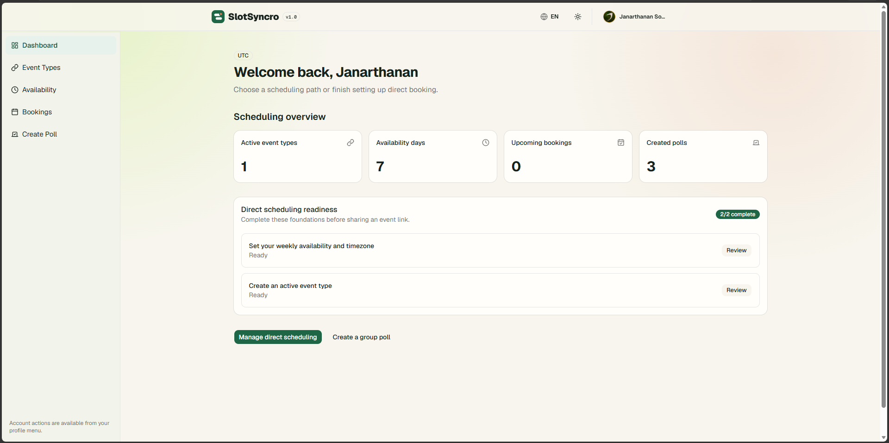
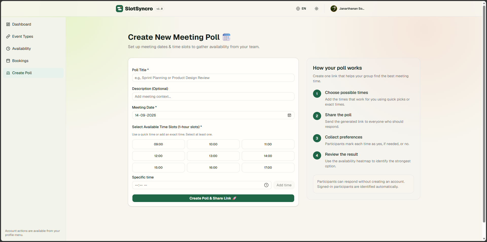
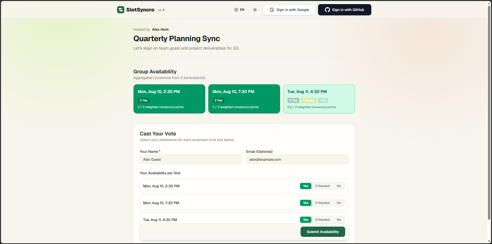

# SlotSyncro 🗓️

> A modern, serverless group scheduling platform and availability heatmap builder built with **Next.js (App Router)**, **TypeScript**, **Turborepo**, and **Neon PostgreSQL**.

## Product and architecture documentation

The maintained product design, feature inventory, repository architecture, and documentation roadmap are available in the [design documentation](./docs/README.md).

[View the SlotSyncro project site](https://techaaroorian.github.io/slotsyncro/)

---

## 📸 Product Preview

### Connected scheduling dashboard

[](./apps/marketing/public/screenshots/dashboard.png)

### Create and share a group poll

[](./apps/marketing/public/screenshots/create-poll.png)

### Collect availability publicly

[](./apps/marketing/public/screenshots/voting-poll.png)

---

## 🏗️ Monorepo Architecture

This project is structured as a **Turborepo** workspace using `pnpm`:

```text
slotsyncro/
├── apps/
│   ├── app/               # Main Next.js App Router application
│   └── marketing/         # Static project site deployed to GitHub Pages
├── packages/
│   ├── db/                # Prisma ORM schema, client export, and DB scripts (@repo/db)
│   ├── eslint-config/     # Shared ESLint configuration
│   └── typescript-config/ # Shared TypeScript configuration
├── .github/
│   └── workflows/
│       ├── coverage.yml   # Test coverage and PR reporting
│       └── pages.yml      # Marketing-site GitHub Pages deployment
├── package.json           # Root pnpm workspace scripts
└── pnpm-workspace.yaml

```

---

## 🛠️ Tech Stack

* **Framework:** Next.js (App Router, React Server Components & Server Actions)
* **Language:** TypeScript
* **Monorepo Tools:** Turborepo & `pnpm` Workspaces
* **Database & ORM:** Neon Serverless PostgreSQL with Prisma v7 (`@repo/db`)
* **Authentication:** Auth.js (NextAuth v5) with GitHub OAuth & JWT sessions
* **Testing:** Vitest, happy-dom, V8 Coverage
* **CI/CD:** GitHub Actions (PR Coverage Reporter & GitHub Pages Deployment)
* **Styling:** Tailwind CSS

---

## 💻 Getting Started

### Prerequisites

* **Node.js:** v20+
* **Package Manager:** `pnpm` v11.24.0

### Environment & Setup

1. **Clone the repository:**

```bash
git clone [https://github.com/TechAaroorian/slotsyncro.git](https://github.com/TechAaroorian/slotsyncro.git)
cd slotsyncro

```

1. **Install workspace dependencies:**

```bash
pnpm install

```

1. **Configure Environment Variables:**
Set up your environment variables for local development:

* Copy `packages/db/.env.example` to `packages/db/.env` (Set `DATABASE_URL` for Neon DB).
* Copy `apps/app/.env.example` to `apps/app/.env.local` (Set `AUTH_SECRET`, OAuth credentials, etc.).

1. **Generate Prisma Client:**

```bash
pnpm --filter db db:generate

```

1. **Run the Development Server:**

```bash
pnpm dev

```

Open the marketing site at [http://localhost:3000](http://localhost:3000) and the product application at [http://localhost:3001](http://localhost:3001).

---

## 🧪 Testing & CI/CD Pipeline

Run the unit test suite across workspace packages with code coverage analysis:

```bash
# Run coverage across the frontend application
pnpm --filter app test:coverage

# Run all workspace test suites via Turborepo
pnpm test

```

### CI/CD Workflow

* **Pull Requests:** GitHub Actions runs `vitest run --coverage`, generates Prisma client artifacts with a CI connection fallback, and posts a line-by-line coverage breakdown as a PR comment.
* **Main Branch:** Builds and deploys the static SlotSyncro project site to **GitHub Pages** when marketing files change.

---

## 🔒 Project Status & Licensing

This repository is maintained primarily as a personal product and portfolio showcase.

* **Contributions & Pull Requests:** External contributions, pull requests, and feature submissions are **not being accepted** at this time. Unsolicited PRs will be closed without merging.
* **License:** **All Rights Reserved.** You are welcome to inspect and review the source code for educational and evaluation purposes. Copying, redistribution, hosting, or commercial usage is strictly prohibited without explicit permission.
