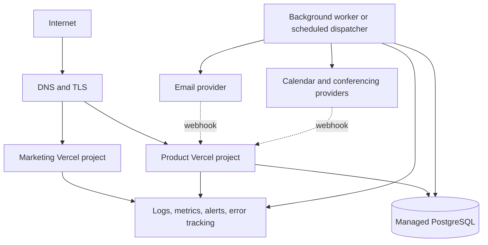
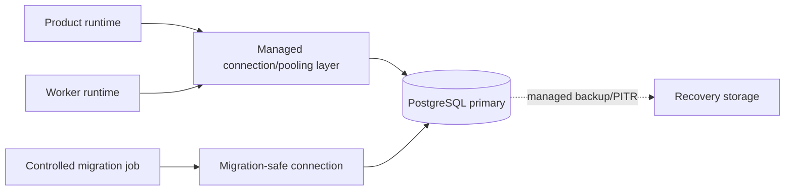

# Proposed Deployment Architecture

**Document status:** Proposed deployment design with accepted application host

**Scope:** Environments, deployable units, infrastructure, delivery, operations, and recovery

**Related documents:** [Repository architecture](./repository-architecture.md), [system architecture](./system-architecture.md), [ADR 0002](./adr/0002-deploy-nextjs-applications-on-vercel.md)

## Purpose

This document maps the logical system architecture to deployable runtime components. It distinguishes the repository's current local setup from a production-minded target so infrastructure is introduced only when a product capability requires it.

Vercel is accepted as the host for both Next.js applications. Database, background-work, and observability vendor choices remain independently evaluated so application hosting does not silently determine every infrastructure decision.

## Current deployment readiness

The repository currently contains:

- `apps/marketing`, a Next.js application that runs locally on port 3000
- `apps/app`, a Next.js product application that runs locally on port 3001
- `packages/db`, a shared Prisma 7 and Neon/PostgreSQL adapter package
- Turborepo tasks for development, build, lint, Prisma generation, and development schema push
- OAuth configuration for Google and GitHub in the product application

Vercel is the accepted production host, but the repository does not yet contain its project configuration or a deployed production environment. It also does not yet define a complete CI/CD pipeline, background-worker runtime, infrastructure-as-code configuration, formal migration pipeline, or recovery procedure. Those items are proposed below, not currently operational.

## Environment model

Use three long-lived environment classes:

| Environment | Purpose | Data policy |
| --- | --- | --- |
| Local | Developer feedback and isolated experimentation | Synthetic or explicitly safe development data |
| Preview | Per-change review of integrated UI and server behavior | Isolated or sanitized data; never silently share production writes |
| Production | Real user traffic and durable business state | Restricted access, monitored changes, backups, and recovery controls |

A shared staging environment may be added when persistent provider certification, migration rehearsal, or cross-team testing justifies its cost. Preview deployments should not automatically receive production OAuth credentials, email domains, calendar tokens, or databases.

## Deployable units

The target retains a small operational footprint:



### Marketing application

Suggested public address: `slotsyncro.com`.

Responsibilities:

- Public product and educational pages
- Search-indexed content
- Legal and trust information
- Calls to action into the product

It should deploy independently and must not receive database, authentication, email, or calendar secrets unless a reviewed server-side use case later requires them.

Configure it as a Vercel project rooted at `apps/marketing`.

### Product application

Suggested public address: `app.slotsyncro.com`.

Responsibilities:

- Authenticated dashboard
- Public booking and poll pages
- Server Actions and route handlers
- Authentication callbacks
- Verified provider webhooks
- Synchronous modular-monolith use cases

The product is one deployable application even though its source is divided into business modules.

Configure it as a separate Vercel project rooted at `apps/app`. `packages/db` remains a workspace dependency rather than a third deployment.

### Background worker

The worker handles durable work such as notification delivery, retries, calendar synchronization, and later reminders. It can initially share the product application's codebase and deployment artifact while running through a scheduled or queue-triggered entry point.

A separately managed service is not required initially. Vercel Cron, Queues, and Workflow are candidates, but the mechanism remains deferred. Extract work into an independently deployed process only when execution limits, throughput, isolation, or scheduling requirements provide evidence for doing so.

The worker must:

- Atomically claim eligible work
- Use a lease or recoverable processing state
- Apply bounded retries with backoff
- Record every delivery attempt
- Be safe when multiple instances run concurrently
- Expose terminal failures for investigation

## Domain and routing model

The proposed public routing boundary is:

```text
slotsyncro.com       -> apps/marketing
app.slotsyncro.com   -> apps/app
```

Both domains use Vercel-managed routing and TLS with explicit redirect/canonical-host rules. OAuth callback URLs, trusted origins, cookie configuration, email links, and provider webhooks must use the environment's canonical product URL.

Preview URLs require separate OAuth applications or a controlled callback strategy. Wildcard callbacks should not be assumed because providers differ and broad callback rules increase risk.

## Database topology

Use managed PostgreSQL as the authoritative store. The application and worker may share one database because they participate in one modular-monolith consistency boundary.



Operational requirements:

- Separate databases or isolated branches/projects per environment
- TLS connections and least-privilege credentials
- Connection limits compatible with horizontally scaled/serverless runtimes
- A dedicated migration path where provider pooling restrictions require it
- Automated backups and point-in-time recovery when real user data exists
- Restore testing, because an untested backup is only an assumption

Read replicas are unnecessary until measured read load or reporting isolation justifies them.

## Build and release pipeline

Turborepo should preserve dependency-aware builds while each application remains independently deployable.


Minimum release gates:

- Lockfile-respecting dependency installation
- Prisma client generation
- Lint and type checking
- Unit and application-service tests
- PostgreSQL integration tests for migrations and constraints
- Production builds for affected workspaces
- Migration safety review when schema changes exist
- Post-deployment smoke tests for critical journeys

Remote build caching may be introduced after CI secret handling and cache trust boundaries are defined. Database mutation tasks remain uncached.

## Database migrations

Production schema changes use committed Prisma migrations, not `db push`. `db push` remains a local prototyping tool.

Use an expand-and-contract approach:

1. **Expand:** add compatible tables, columns, constraints, or indexes.
2. **Deploy compatible code:** read old state while writing the new representation where necessary.
3. **Backfill:** migrate existing records with measured counts and resumable batches.
4. **Verify:** compare old/new representations and inspect invalid data.
5. **Cut over:** make new reads authoritative.
6. **Constrain:** add stricter non-null, unique, or relational guarantees after data is valid.
7. **Contract:** remove legacy structures in a later release.

Migration execution must be serialized. Application instances should not each attempt production migrations during startup.

Every risky migration needs:

- Expected lock and runtime characteristics
- Pre-migration validation queries
- Backup/recovery posture
- Forward-fix or rollback plan
- Post-migration reconciliation counts

## Configuration and secrets

Configuration is environment-specific and supplied by the deployment platform or secret manager. Commit variable names and purpose, never secret values.

Currently verified server-side variables include:

| Variable | Consumer | Purpose |
| --- | --- | --- |
| `DATABASE_URL` | Product runtime, worker, Prisma tooling | PostgreSQL connection |
| `AUTH_GOOGLE_ID` | Product application | Google OAuth client identity |
| `AUTH_GOOGLE_SECRET` | Product application | Google OAuth client secret |
| `AUTH_GITHUB_ID` | Product application | GitHub OAuth client identity |
| `AUTH_GITHUB_SECRET` | Product application | GitHub OAuth client secret |

Authentication framework secrets, canonical URL settings, email credentials, webhook-signing secrets, calendar credentials, encryption keys, and worker-trigger credentials must be documented when their exact runtime contracts are reconciled with the implementation branch.

Secret rules:

- Scope each secret to only the deployment that consumes it.
- Use separate credentials per environment.
- Keep secrets out of browser-exposed variables, logs, build output, fixtures, and preview comments.
- Rotate credentials without requiring data migration where possible.
- Treat provider OAuth refresh tokens as sensitive persisted secrets and encrypt them at rest.
- Audit access to production secrets.

## Email and calendar delivery

Only the worker should normally perform retryable provider delivery. Product requests commit notification or integration work and return based on internal business state.

Production email readiness requires:

- A verified sending domain
- SPF, DKIM, and appropriate DMARC policy
- Environment-specific recipients or suppression in non-production
- Provider event/webhook verification
- Bounce, complaint, and suppression handling
- Stable message idempotency keys
- No sensitive values in provider metadata

Calendar readiness requires:

- Environment-specific OAuth applications
- Minimal provider scopes
- Encrypted refresh-token storage
- Idempotent external event creation/update
- Webhook renewal and deduplication
- Reconciliation for missed or out-of-order provider events

## Observability and alerting

Logs, metrics, traces/error reports, and domain history answer different questions and should remain distinct.

### Structured logs

Include:

- Environment and deploy version
- Correlation/request ID
- Use-case or job name
- Safe internal resource IDs
- Outcome and stable error category
- Duration and retry attempt

Exclude secrets, raw tokens, database URLs, OAuth payloads, and unnecessary personal data.

### Initial service indicators

Track:

- Product request error rate and latency
- Booking and poll-finalization success/conflict rates
- Database connection saturation and query latency
- Pending-work count and age of oldest item
- Notification/calendar attempt success and terminal failure rates
- Webhook invalid-signature and duplicate counts
- Deployment health and critical-journey smoke results

Alerts should identify an actionable user or data risk. Avoid alerting on every isolated provider retry.

## Health and readiness

The product runtime needs a lightweight liveness signal and, where the platform supports it, a readiness signal that reflects whether it can safely serve requests.

Do not make a health endpoint perform expensive provider calls. Provider degradation should appear in delivery metrics and work-item state rather than taking the entire product offline.

Worker health is better measured by progress—claim success, oldest-work age, and terminal failures—than by the existence of a running process alone.

## Backup and recovery

Before storing important user data, define:

- Automated backup frequency and retention
- Point-in-time recovery window
- Recovery-time objective (RTO): acceptable restoration duration
- Recovery-point objective (RPO): acceptable amount of data loss measured in time
- Restore ownership and access
- A recurring restore test

Database backup does not automatically restore provider state. Recovery procedures must reconcile internal meetings, notification attempts, and external calendar events after a restore.

Prefer forward fixes for ordinary application releases. Rollback is safe only when the previous application version remains compatible with the migrated schema.

## Security and operational access

- Production database and provider dashboards use least-privilege access and multi-factor authentication.
- Deployment tokens belong to automation identities, not personal credentials.
- Production access is logged and limited to necessary maintainers.
- Public endpoints receive rate limiting and abuse monitoring.
- Webhooks require signature verification and replay protection.
- Dependency and secret scanning should run in CI when the pipeline is introduced.
- Security headers and cookie behavior must be verified independently for marketing and product domains.

## Cost and scaling principles

Scale from evidence:

- Increase product instances for measured request concurrency.
- Increase worker concurrency for measured queue age, while respecting database and provider limits.
- Add caching for demonstrated read patterns with clear invalidation rules.
- Add read replicas only for measured database pressure.
- Split services only for independent scaling, reliability, security, deployment, data, or team ownership needs.

Feature count alone does not justify distributed infrastructure.

## Failure scenarios

| Failure | Expected behavior |
| --- | --- |
| Email provider unavailable | Meeting stays confirmed; notification retries and becomes visible if terminal |
| Calendar provider timeout | Internal meeting remains authoritative; synchronization retries idempotently |
| Worker stops | Pending work accumulates durably; alert on age; resume without losing intent |
| Product deploy fails | Previous healthy release continues or deployment rolls back without schema incompatibility |
| Migration fails | Stop rollout, preserve logs/counts, apply reviewed recovery or forward fix |
| Database unavailable | Reject state changes safely; do not claim success; recover through managed service procedures |
| Duplicate webhook | Deduplication returns success without repeating the transition |
| Database restore | Reconcile durable work and external provider state before declaring full recovery |

## Incremental implementation plan

1. Create separate Vercel projects rooted at `apps/marketing` and `apps/app`.
2. Configure preview and production domains, environment variables, and deployment protection.
3. Provision isolated preview and production databases.
4. Replace production `db push` assumptions with committed migration execution.
5. Add structured logging, deploy version, and critical-journey smoke checks.
6. Introduce notification work items and a scheduled dispatcher.
7. Add provider webhook verification and delivery monitoring.
8. Enable production backup/PITR and run a documented restore exercise.
9. Add calendar worker capabilities only after internal meeting lifecycle is stable.

## Deferred decisions

- CI/CD checks beyond Vercel's Git deployment integration
- Worker execution model: scheduled endpoint, queue consumer, or long-lived process
- Preview database isolation mechanism
- Observability and error-tracking vendors
- Exact backup retention, RTO, and RPO
- Rate-limit technology and thresholds
- Custom-domain support
- Infrastructure-as-code tool and adoption point

These decisions should be made near implementation, with current provider constraints and measured requirements.

## Acceptance checklist

- [ ] Current and proposed deployment capabilities are clearly separated.
- [ ] Marketing, product, worker, database, and provider trust boundaries are explicit.
- [ ] Every environment has isolated credentials and an intentional data policy.
- [ ] Production schema changes use reviewed, serialized migrations.
- [ ] Application deployment and schema evolution remain backward compatible during rollout.
- [ ] Durable external work can retry without duplicating business outcomes.
- [ ] Secrets are scoped, rotatable, and absent from client/build output.
- [ ] Logs and metrics can trace requests, jobs, deploys, and provider failures safely.
- [ ] Backups have defined recovery targets and a tested restore procedure.
- [ ] Scaling decisions depend on evidence rather than portfolio appearance.

## Related delivery plan

The [roadmap](./roadmap.md) converts this architecture into vertical milestones with dependencies, decision gates, tests, migrations, operational evidence, and content checkpoints.
