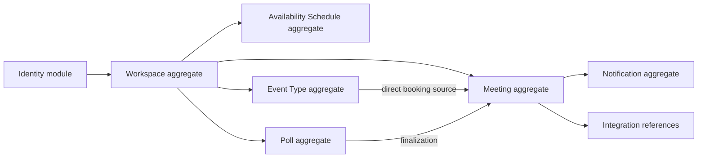

# Proposed Domain Decisions

**Document status:** Accepted modeling directions; explicitly noted mechanisms remain unresolved
**Purpose:** Resolve the major choices exposed by the journeys, use cases, business rules, and current ER audit before drawing the proposed ER model

## How to use this document

This document is a decision workshop, not an implementation specification.

Each decision contains:

- The problem
- Recommended direction
- Alternatives considered
- Consequences
- Rules and use cases affected
- Questions still requiring confirmation

Decision statuses:

| Status | Meaning |
| --- | --- |
| **Recommended** | Preferred direction based on current evidence; awaiting explicit acceptance |
| **Accepted** | Approved direction suitable for proposed-model design |
| **Deferred** | Intentionally postponed because current use cases do not require it |
| **Unresolved** | More product or technical evidence is required |

Accepted decisions that are expensive to reverse will later receive their own ADRs.

## Decision summary

| ID | Decision | Recommendation | Status |
| --- | --- | --- | --- |
| DD-001 | Scheduled commitment | Introduce `Meeting` as the shared final commitment | Accepted |
| DD-002 | Direct-booking source | Retain a source record linked one-to-one with its meeting | Accepted |
| DD-003 | Poll outcome | Finalized poll links to one selected candidate and one meeting | Accepted |
| DD-004 | Participant identity | Use poll/meeting-scoped participant entities with optional user link | Accepted |
| DD-005 | Ownership boundary | Introduce a personal workspace for every user; add team UX later | Accepted |
| DD-006 | Availability model | Separate schedule timezone from user profile and normalize windows | Accepted |
| DD-007 | Lifecycle history | Current state plus append-only lifecycle events; not full event sourcing | Accepted |
| DD-008 | Deletion and retention | Archive configuration; preserve/anonymize transactional history | Accepted |
| DD-009 | Notifications | Persist notification intent and delivery attempts separately | Accepted |
| DD-010 | External integrations | Keep provider connections/references outside core meeting columns | Accepted |
| DD-011 | Concurrency | Database-backed overlap protection plus command idempotency | Accepted principle; mechanism unresolved |
| DD-012 | Open and private polls | Support both through explicit access policy | Accepted |

---

## DD-001: Introduce Meeting as the shared scheduled commitment

**Status:** Accepted

### Problem

The current `Booking` record represents a direct guest reservation. Poll finalization also needs to create a scheduled commitment, but a poll is not naturally a booking made by one guest.

If poll outcomes are forced into the current `Booking` shape, fields such as one guest name and one guest email become misleading. If direct bookings and poll outcomes create unrelated scheduled entities, cancellation, rescheduling, calendar synchronization, and meeting management must be implemented twice.

### Recommendation

Introduce `Meeting` as the aggregate root for a finalized scheduled commitment.

Both paths converge on it:

```text
Event type + direct booking request ──┐
                                     ├──> Meeting
Poll + selected candidate ───────────┘
```

`Meeting` owns:

- Scheduled start and end
- Current lifecycle status
- Host/participant relationships
- General meeting location
- Version for concurrent changes
- Creation source
- Lifecycle history
- External calendar references through integration entities

### Alternatives considered

#### Keep `Booking` as the universal scheduled entity

Simpler migration, but the name and guest-specific fields fit direct booking better than group outcomes. It risks a growing collection of nullable poll/team fields.

#### Create separate `BookingMeeting` and `PollMeeting`

Preserves source-specific models but duplicates cancellation, rescheduling, participant, notification, and integration behavior.

### Consequences

- Meeting lifecycle is implemented once.
- Current bookings require migration or transitional mapping.
- “Booking” and “meeting” receive distinct meanings.
- Source-specific input remains outside the core meeting.

### Affected rules/use cases

- UC-BKG-001
- UC-POL-003
- UC-MTG-001 through UC-MTG-003
- BR-MTG-001 through BR-MTG-011

---

## DD-002: Preserve a direct-booking source record

**Status:** Accepted

### Problem

Direct booking captures facts that do not belong to every meeting:

- Event type used
- Guest-submitted name, email, timezone, and notes
- Public booking idempotency key
- Booking-specific authorization/management token

Discarding this information after creating a meeting loses provenance. Storing it all on `Meeting` makes poll-created meetings sparse and semantically unclear.

### Recommendation

Retain a direct-booking source entity linked one-to-one with the resulting meeting.

Working term:

```text
DirectBooking
    ├── source EventType
    ├── guest submission snapshot
    └── resulting Meeting
```

The current `Booking` table may evolve into this source entity during migration rather than being deleted immediately.

### Snapshot principle

Store enough accepted booking context to interpret the meeting even if the event type later changes or is archived. Exact snapshot fields will be selected in the proposed ER model.

### Consequences

- Meeting remains source-neutral.
- Historical direct-booking context survives event-type edits.
- A one-to-one constraint prevents one booking request from creating several meetings.
- Migration can reuse current booking IDs or preserve a mapping.

---

## DD-003: Finalized poll has one selected candidate and one meeting

**Status:** Accepted

### Problem

The current poll has candidates and votes but no lifecycle outcome. Proposed finalization must prevent:

- Selecting a candidate from another poll
- Creating multiple meetings from repeated finalization
- Marking the poll finalized without creating its meeting
- Creating the meeting without locking the poll

### Recommendation

A finalized poll records:

- `selectedCandidateId`
- `finalizedAt`
- Finalizing actor or automation source
- `meetingId`

The selected candidate must belong to the same poll. Poll finalization, meeting creation, participant creation, and durable external-work creation occur in one transaction.

### Structural direction

Prefer a relationship design that makes cross-poll candidate selection impossible or enforceable through a composite key, rather than relying only on a pre-check.

### Consequences

- Poll has one authoritative outcome.
- Repeated finalization can return the existing meeting.
- Poll and meeting lifecycles remain distinct but connected.
- Cancelling the meeting does not reopen the poll automatically.

### Open policy

Whether an authorized host may explicitly reopen a finalized poll is deferred. Default recommendation: no backward transition; create a rescheduling poll instead.

---

## DD-004: Use scoped participant entities

**Status:** Accepted

### Problem

The current poll repeats participant name and email on every vote. Name is simultaneously treated as display label, identity, and edit authorization.

A global “person” table is also risky because accountless identities may be duplicated, mistyped, privacy-sensitive, or unrelated across workspaces.

### Recommendation

Use scoped participant entities:

```text
PollParticipant
├── pollId
├── optional userId
├── displayName
├── normalized email when supplied
├── participant role: REQUIRED / OPTIONAL
├── response state
└── invitation/edit-token metadata

MeetingParticipant
├── meetingId
├── optional userId
├── displayName/email snapshot
├── attendance role
└── response/delivery context when needed
```

Individual candidate preferences reference `PollParticipant.id`, not a participant name.

### Why not one global Contact initially?

- Contact deduplication rules are unclear.
- Two workspaces may intentionally have independent contact records.
- Email is not always available or immutable.
- Global contact identity introduces privacy and ownership questions not required by the first use cases.

### Consequences

- Same-name participants do not collide.
- Email is stored once per poll participant rather than once per vote.
- Accountless and authenticated participation coexist.
- Poll participants can be copied into meeting participants at finalization.
- Poll and meeting participant records preserve context-specific snapshots.

### Open policy

The exact token design, response anonymity, and email-normalization policy remain to be specified in security/system architecture.

---

## DD-005: Introduce personal workspaces as the ownership boundary

**Status:** Accepted

### Problem

Most current resources belong directly to `User`. Future collaboration requires shared resources, roles, invitations, and tenant isolation. Adding workspace ownership after large amounts of user-owned data exist would require a broader migration.

Exposing organization concepts immediately, however, would complicate the experience for individual users.

### Recommendation

Every user receives one personal workspace. Team-workspace creation and switching remain later UI capabilities.

```text
User
  └── WorkspaceMembership (OWNER)
          └── Personal Workspace
```

Workspace owns product resources such as:

- Event types
- Availability schedules where appropriate
- Polls
- Meetings
- Notification policy/configuration

User fields still identify actors such as creator, host, finalizer, or canceller.

### Ownership distinction

```text
workspaceId  = Which tenant owns this data?
createdById  = Which user created it?
hostId       = Which user hosts the meeting?
```

These are separate questions.

### Alternatives considered

#### Keep direct user ownership until team features

Simpler now, but creates a later migration across most product tables.

#### Put one `organizationId` on User

Rejects multi-workspace membership and cannot represent different roles in different workspaces.

### Consequences

- Multi-tenant boundary becomes explicit early.
- Individual UX can remain simple by hiding the workspace switcher when only one exists.
- Every resource query must include or derive workspace scope.
- Personal workspace provisioning must be idempotent.
- Migration must create one workspace and owner membership per existing user.

### Open policy

- Whether availability is user-owned but workspace-visible, or workspace-owned and assigned to a user
- Resource transfer when a member leaves
- Workspace deletion and retention

---

## DD-006: Normalize recurring availability windows

**Status:** Accepted

### Problem

Current `UserAvailability` stores summary `startTime`/`endTime` plus JSON `slots`. This duplicates information and prevents strong database relationships or window-level queries.

The user profile timezone also acts as the interpretation timezone for all recurring schedules, coupling profile preferences to scheduling rules.

### Recommendation

Introduce an availability-schedule root with its own timezone and child windows.

```text
AvailabilitySchedule
├── owner/host context
├── workspace scope
├── timezone
├── active/default metadata
└── AvailabilityWindow[]
        ├── weekday
        ├── local start
        └── local end
```

Disabled days can be represented by absence of windows unless later UX requires an explicit disabled-day record.

### Why normalize here?

Expected requirements include:

- Multiple windows per day
- Window-level validation
- Overlap detection
- Candidate generation
- Possibly multiple schedules or overrides later
- Clear single source of truth

These provide stronger evidence for child rows than generic normalization preference alone.

### Consequences

- JSON migration is required.
- Window constraints become clearer.
- Full schedule replacement still requires one transaction.
- Profile timezone can change without silently reinterpreting an existing schedule.

### Deferred detail

The physical representation of local time—database `time`, minute-of-day integer, or validated string—will be chosen after reviewing Prisma/PostgreSQL behavior and required calculations.

---

## DD-007: Current state plus append-only lifecycle events

**Status:** Accepted

### Problem

A mutable `status` field answers what is true now but cannot explain:

- Who changed it
- Why it changed
- Previous scheduled time
- Whether automation or a person initiated it
- Which notification or provider work followed

Full event sourcing would preserve every change but introduces substantial complexity not justified by current requirements.

### Recommendation

Use:

1. Current state on the aggregate for efficient reads.
2. Append-only lifecycle events for important transitions.
3. A version number for optimistic concurrency.

Example:

```text
Meeting
├── status = SCHEDULED
├── startAt / endAt
└── version = 3

MeetingEvent
├── type = RESCHEDULED
├── actor
├── occurredAt
└── structured transition context
```

This is an audit/history pattern, not full event sourcing. Current state remains authoritative and is not rebuilt from every event on normal reads.

### Consequences

- Common reads remain simple.
- Important transitions are explainable.
- Rescheduling history can be retained.
- Event payload design and privacy retention require discipline.
- Domain transition service must update current state and append event atomically.

---

## DD-008: Archive configuration and preserve transactional history

**Status:** Accepted

### Problem

Current cascades can delete bookings when event types or users are deleted. Configuration and historical commitments have different retention needs.

### Recommendation

- Archive event types after they have produced scheduled history.
- Prevent routine hard deletion of referenced configuration.
- Store accepted snapshots required to interpret historical meetings.
- Preserve meeting lifecycle history subject to privacy policy.
- Anonymize or detach personal data where deletion obligations require it rather than blindly cascading every transactional record.
- Reserve hard deletion for controlled retention/privacy workflows.

### Consequences

- Referential actions become more conservative.
- Account deletion requires an explicit workflow.
- Historical analytics and audit remain possible.
- Privacy rules must define which participant fields can remain and for how long.

### Unresolved policy

Formal data-retention periods and legal/privacy obligations are outside the current portfolio scope but must be decided before real external usage.

---

## DD-009: Persist notification intent and attempts separately

**Status:** Accepted

### Problem

External delivery can fail after business state commits. A single status on `Meeting` cannot represent multiple recipients, channels, retries, or provider attempts.

### Recommendation

Separate notification intent from delivery attempts:

```text
Notification
├── business event and recipient
├── channel/template
├── current delivery state
└── NotificationAttempt[]
        ├── attemptedAt
        ├── provider
        ├── provider reference
        └── sanitized outcome
```

Notification intent is created in the same transaction as the business transition when delivery is required. A background processor performs attempts after commit.

### Consequences

- Meeting and email truth remain separate.
- Retries and delivery history become visible.
- One meeting can notify several participants independently.
- A job-claiming and retry policy is required.
- Template input must be reproducible without relying on mutable UI state.

### Deferred detail

Whether `Notification` itself acts as an outbox job or references a generic job table will be decided in system architecture.

---

## DD-010: Isolate provider-specific integration data

**Status:** Accepted

### Problem

The current `googleMeetLink` field couples a core booking record to one provider. Calendar and conferencing providers have different event IDs, account connections, synchronization states, and webhook versions.

### Recommendation

Core `Meeting` stores provider-neutral location meaning. Provider-specific state lives in integration entities:

```text
CalendarConnection
├── user/workspace ownership
├── provider
├── external account reference
├── encrypted credential reference
└── connection status

ExternalCalendarEvent
├── meetingId
├── connectionId
├── provider event ID
├── calendar ID
├── sync status/version
└── last synchronized time
```

Meeting location may use provider-neutral types such as video, phone, in-person, or custom URL, with a separate integration reference when generated externally.

### Consequences

- Core meeting model does not change for every provider.
- Provider retries and webhook reconciliation have a home.
- Credential storage requires a security design separate from ordinary product data.
- One meeting can potentially synchronize to more than one calendar without repeated core columns.

---

## DD-011: Use database-backed overlap protection and command idempotency

**Status:** Accepted principle; exact mechanism unresolved

### Problem

An application query followed by insert cannot prevent concurrent overlapping reservations. Network retries can also repeat a logically identical command.

These are different problems:

- Concurrency invariant: two active intervals must not overlap.
- Idempotency invariant: one logical command must not create two outcomes.

### Recommendation

Use both:

1. Database-backed overlap protection for blocking meeting/reservation intervals.
2. Scoped unique idempotency keys for public creation/finalization commands.

### Mechanisms to evaluate

- PostgreSQL range/exclusion constraint with status-aware behavior
- Serializable transaction or targeted advisory locking
- Explicit slot/hold reservation model when candidate granularity permits it

The chosen approach must support variable-length intervals, cancellation semantics, and Prisma migrations without hiding critical SQL behavior.

### Consequences

- Friendly pre-check remains useful but is not final enforcement.
- Database/provider errors require domain-safe translation.
- Concurrency integration tests are required.
- Custom SQL migration may be justified and should be documented if selected.

### ADR threshold

The exact overlap mechanism is expensive to reverse and should receive an ADR after a focused database design experiment.

---

## DD-012: Support open-link and invitation-only polls explicitly

**Status:** Accepted

### Problem

Open polls reduce friction but provide weak identity and abuse protection. Invitation-only polls support controlled participation but require participant and token lifecycle management.

### Recommendation

Model poll access policy explicitly rather than inferring it from whether invitation rows exist.

Initial policy candidates:

```text
OPEN_LINK
INVITATION_ONLY
```

Possible future policies such as workspace-only should be added only with a real use case.

### Consequences

- Query and mutation authorization can branch on one explicit policy.
- Invitation-only participants have durable identity and edit access.
- Open-link participants still need rate limiting and a private edit mechanism.
- Result visibility should be a separate policy rather than implied by access mode.

---

## Proposed aggregate map

This is a conceptual map, not yet the proposed ER diagram.



Aggregate boundaries indicate transactional ownership, not separate services or databases.

## Decisions likely to become ADRs

After review, create ADRs for:

1. Unified `Meeting` aggregate for direct and poll scheduling
2. Personal-workspace tenancy boundary
3. Meeting lifecycle state plus append-only history
4. Database overlap-protection strategy
5. Durable notification/outbox approach

Participant and schedule representation may remain domain-model decisions unless their trade-offs become cross-cutting or difficult to reverse.

## Review checklist

Before accepting these recommendations, verify:

- [ ] Direct booking still has a simple guest experience.
- [ ] Poll finalization creates exactly one meeting.
- [ ] Accountless participation remains possible.
- [ ] Workspace concepts do not unnecessarily appear for single users.
- [ ] Schedule timezone does not silently change with profile preferences.
- [ ] Historical meetings survive configuration changes.
- [ ] Deletion and privacy are intentional.
- [ ] Provider failures remain separate from meeting truth.
- [ ] Concurrency and idempotency solve different invariants.
- [ ] Migration from every current table is explainable.

## Related design outcomes

These decisions are represented in the [proposed domain model](./domain-model-proposed.md), realized at runtime by the [system architecture](./system-architecture.md), and sequenced in the [roadmap](./roadmap.md). Deferred physical mechanisms become focused ADRs or prototypes at the roadmap decision gates.
