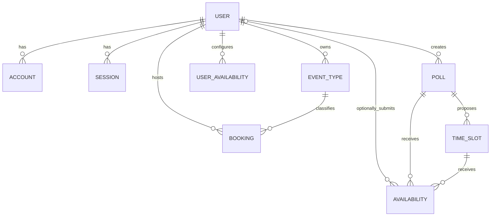
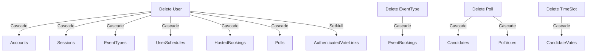

# Current Domain and ER Model

**Document status:** Current-state analysis  
**Schema source:** `packages/db/prisma/schema.prisma` on the documentation branch  
**Reviewed:** 2026-08-29

## Purpose

This document describes the database model that exists today. It does not add proposed entities or silently correct current limitations.

Its goals are to:

- Make current entities and relationships understandable.
- Record keys, constraints, indexes, nullability, and referential actions.
- Explain which business rules the database enforces.
- Identify integrity gaps and ambiguous ownership.
- Provide a factual baseline for a separate proposed ER model.

## ER concepts used in this document

### Entity

An entity is a distinguishable domain or infrastructure concept whose instances are stored independently. In the current schema, `User`, `EventType`, `Booking`, and `Poll` are entities.

An entity is not simply every noun visible in the UI. “Host” and “guest,” for example, are roles. The current schema stores a host as a `User`, while guest details are embedded in `Booking`.

### Attribute

An attribute is a stored property of an entity, such as `Booking.startTime` or `EventType.duration`.

Attributes may be:

- Required or optional
- Unique or repeatable
- Mutable or effectively immutable
- Domain values or infrastructure metadata

### Primary key

A primary key uniquely identifies one row. Every current model uses a surrogate string key named `id`, except `VerificationToken`, which uses a composite unique constraint but has no explicit `@id` field.

### Foreign key

A foreign key connects one row to another entity and preserves referential integrity. `Booking.hostId`, for example, must reference an existing `User.id`.

Foreign keys prove that a referenced row exists. They do not automatically prove that the current actor is authorized to access it.

### Cardinality

Cardinality describes how many records can participate in a relationship:

- One-to-one
- One-to-many
- Many-to-many through an associative entity

For example, one `Poll` has many `TimeSlot` records, while each `TimeSlot` belongs to exactly one `Poll`.

### Optionality

Optionality describes whether a relationship or value is required. `Availability.userId` is optional, so a vote may be associated with an authenticated user or remain accountless.

### Candidate key and unique constraint

A candidate key is an alternate set of attributes capable of identifying a record. The current event-type scope uses `(userId, slug)` as a candidate key enforced through a composite unique constraint.

### Index

An index accelerates selected query patterns. It does not necessarily enforce a business invariant. A unique index/constraint can do both, but a normal index such as `Booking(hostId)` only improves lookup performance.

### Referential action

A referential action decides what happens to dependent rows when the referenced row is deleted:

- `Cascade`: delete dependents automatically
- `SetNull`: retain dependent rows and clear the optional reference
- `Restrict`/`NoAction`: prevent or defer deletion when dependents exist

Referential actions are product data-retention decisions, not merely ORM configuration.

## Current high-level ER diagram



`VerificationToken` is intentionally not connected in the diagram because the current schema stores its identifier as a string rather than a foreign key to `User`.

## Current model groups

```text
Identity infrastructure
├── User
├── Account
├── Session
└── VerificationToken

Direct scheduling
├── EventType
├── UserAvailability
└── Booking

Group polling
├── Poll
├── TimeSlot
└── Availability
```

These groups reflect current schema organization. They are not yet enforced modular-monolith boundaries.

---

## Entity: User

### Purpose

Represents an authenticated SlotSyncro account and currently acts as the ownership root for most product data.

### Important attributes

| Attribute | Required? | Constraint/default | Meaning |
| --- | --- | --- | --- |
| `id` | Yes | Primary key, generated CUID | Internal user identity |
| `name` | No | None | Display name from provider/profile |
| `email` | No | Unique when present | Account email |
| `emailVerified` | No | None | Verification timestamp |
| `image` | No | None | Profile image URL |
| `username` | No | Unique when present | Public scheduling identity |
| `timeZone` | Yes | Defaults to `UTC` | Current scheduling timezone string |
| `createdAt` | Yes | Defaults to current time | Creation metadata |
| `updatedAt` | Yes | Automatically updated | Modification metadata |

### Relationships

| Relationship | Cardinality | Delete behavior |
| --- | --- | --- |
| User to Account | One-to-many | Deleting user cascades accounts |
| User to Session | One-to-many | Deleting user cascades sessions |
| User to EventType | One-to-many | Deleting user cascades event types |
| User to UserAvailability | One-to-many | Deleting user cascades schedules |
| User to Booking as host | One-to-many | Deleting user cascades hosted bookings |
| User to Poll | One-to-many | Deleting user cascades polls |
| User to Availability vote | One-to-many, optional from vote side | Deleting user sets vote `userId` to null |

### Current observations

- `User` is both identity and product-ownership root.
- Optional unique email and username allow accounts without those values.
- `timeZone` is a non-empty-required database string, but the database cannot determine whether it is a valid IANA timezone.
- `@@index([username])` may be redundant because a unique constraint already creates an index in PostgreSQL. Confirm generated migration behavior before removing it.
- Deleting a user triggers deletion of most owned product history, including hosted bookings and polls.

### Business rules enforced

- BR-ID-003 through `Account`, not directly on `User`
- BR-ID-004: email uniqueness when present
- Part of BR-ID-001: username uniqueness, but not normalization policy

---

## Entity: Account

### Purpose

Stores an Auth.js external authentication account linked to one `User`.

### Keys and constraints

| Key | Definition | Purpose |
| --- | --- | --- |
| Primary key | `id` | Internal account record identity |
| Foreign key | `userId -> User.id` | Account owner |
| Composite unique | `(provider, providerAccountId)` | Prevent duplicate provider identity |

### Relationship

Many `Account` records may belong to one `User`, allowing a user to link multiple authentication providers conceptually.

### Current observations

- Provider access and refresh tokens are stored directly in the record because Auth.js requires provider credentials.
- Security depends on database access controls and secret handling; these fields must never be exposed through general user queries or logs.
- Deleting the user cascades account deletion.

---

## Entity: Session

### Purpose

Provides the Auth.js adapter-compatible database-session model associated with one user. The current application configures `session.strategy` as `jwt`, so this table exists in the schema but is not the authoritative store for the active runtime session strategy.

### Keys and constraints

| Key | Definition |
| --- | --- |
| Primary key | `id` |
| Unique | `sessionToken` |
| Foreign key | `userId -> User.id` |

### Current observations

- The relationship permits multiple session rows per user when database-session behavior is used.
- Expiration is stored as a required timestamp.
- Deleting the user cascades sessions.
- The current JWT strategy stores active session state differently; schema presence does not prove runtime usage.
- Expired database-session cleanup, if that strategy is used, is an operational concern rather than an ER relationship.

---

## Entity: VerificationToken

### Purpose

Stores a time-limited Auth.js verification token identified by an external string such as an email address.

### Keys and constraints

| Constraint | Definition |
| --- | --- |
| Unique token | `token` |
| Composite unique | `(identifier, token)` |

### Current observations

- There is no foreign key to `User`; verification may occur before a user exists.
- `identifier` is an authentication identifier, not a guaranteed user ID.
- The schema has no explicit `@id`. Prisma supports models with a unique criterion, but the model's identity semantics differ from other tables.

---

## Entity: EventType

### Purpose

Defines a reusable direct-booking configuration owned by one user.

### Important attributes

| Attribute | Required? | Constraint/default | Meaning |
| --- | --- | --- | --- |
| `id` | Yes | Primary key | Event-type identity |
| `title` | Yes | Application length validation | Public title |
| `slug` | Yes | Unique with `userId` | Public route segment |
| `description` | No | Database text | Public context |
| `duration` | Yes | Application range validation | Meeting length in minutes |
| `isArchived` | Yes | Defaults false | Whether new bookings are disabled |
| `bufferBefore` | Yes | Defaults zero | Pre-meeting blocked minutes |
| `bufferAfter` | Yes | Defaults zero | Post-meeting blocked minutes |
| `userId` | Yes | Foreign key | Owner |

### Keys and indexes

| Type | Definition | Effect |
| --- | --- | --- |
| Primary key | `id` | Identifies record |
| Composite unique | `(userId, slug)` | Enforces owner-scoped public slug |
| Index | `userId` | Supports owner listing/filtering |

### Relationships

- Each `EventType` belongs to exactly one `User`.
- One `EventType` may have many `Booking` records.
- Deleting the owner cascades the event type.
- Deleting the event type cascades its bookings through the booking foreign key.

### Current observations

- Duration and buffer validity are enforced by application validation, not database checks.
- Archive state protects public creation without erasing the event type.
- Hard deletion may erase booking history because of cascading relationships.
- Booking stores the event-type relationship but does not snapshot title, duration, or buffers. Historical interpretation therefore depends on a mutable event type remaining available.

### Business rules enforced

- BR-EVT-001: owner-scoped slug uniqueness
- Referential part of BR-BKG-001: referenced event type and host exist, though their ownership match requires application logic

---

## Entity: UserAvailability

### Purpose

Stores one user's recurring availability configuration for one weekday.

### Important attributes

| Attribute | Required? | Constraint/default | Meaning |
| --- | --- | --- | --- |
| `id` | Yes | Primary key | Record identity |
| `day` | Yes | `DayOfWeek` enum | Weekday |
| `isAvailable` | Yes | Defaults true | Whether the day contributes candidates |
| `startTime` | Yes | String | Legacy/summary first start time |
| `endTime` | Yes | String | Legacy/summary last end time |
| `slots` | Yes | JSON | Array of local start/end windows |
| `userId` | Yes | Foreign key | Schedule owner |

### Keys and indexes

| Type | Definition |
| --- | --- |
| Primary key | `id` |
| Composite unique | `(userId, day)` |
| Index | `userId` |

### Current representation

One row contains both scalar summary values and a JSON collection:

```json
{
  "day": "MONDAY",
  "startTime": "09:00",
  "endTime": "17:00",
  "slots": [
    { "startTime": "09:00", "endTime": "12:00" },
    { "startTime": "14:00", "endTime": "17:00" }
  ]
}
```

### Current observations

- `(userId, day)` correctly models at most one weekday configuration per user.
- Multiple windows are embedded in JSON rather than normalized into a child table.
- `startTime` and `endTime` duplicate information derivable from `slots`.
- The database cannot validate JSON window shape, ordering, overlap, or `start < end` through the Prisma schema.
- A disabled day still stores fallback windows; `isAvailable` determines whether they are effective.
- User timezone is stored on `User`, so changing it changes the interpretation of all recurring windows.

### Normalization trade-off

Embedding windows in JSON reduces table count and makes saving one day simple. It also moves integrity and querying responsibility into application code.

A normalized alternative would use a `ScheduleWindow` child entity, but that is a proposed-model decision—not an automatic improvement. The correct choice depends on validation, query, mutation, and history requirements.

### Business rules enforced

- BR-SCH-003: one row per user and weekday
- Referential ownership to `User`

Rules such as BR-SCH-002 and BR-SCH-006 are not enforced structurally.

---

## Entity: Booking

### Purpose

Represents a guest reservation for one host and one event type.

### Important attributes

| Attribute | Required? | Constraint/default | Meaning |
| --- | --- | --- | --- |
| `id` | Yes | Primary key | Booking identity |
| `hostId` | Yes | Foreign key | Hosting user |
| `eventTypeId` | Yes | Foreign key | Booking configuration |
| `guestName` | Yes | Application limits | Guest label |
| `guestEmail` | Yes | Application email validation | Guest contact |
| `guestNotes` | No | Database text | Optional context |
| `guestTimeZone` | Yes | String | Guest timezone label/context |
| `startTime` | Yes | Timestamp | Scheduled absolute start |
| `endTime` | Yes | Timestamp | Scheduled absolute end |
| `status` | Yes | Defaults `ACCEPTED` | `PENDING`, `ACCEPTED`, or `CANCELLED` |
| `googleMeetLink` | No | None | Provider-specific meeting URL |

### Keys and indexes

| Type | Definition | Intended query support |
| --- | --- | --- |
| Primary key | `id` | Direct lookup |
| Index | `hostId` | Host booking list/conflicts |
| Index | `eventTypeId` | Event-type booking lookup |
| Composite index | `(startTime, endTime)` | Time-range filtering |

### Relationships

- Each booking references exactly one host `User`.
- Each booking references exactly one `EventType`.
- One host can have many bookings.
- One event type can have many bookings.
- Deleting host or event type cascades booking deletion.

### Integrity gap: host and event type

The database proves:

```text
Booking.hostId references an existing User
Booking.eventTypeId references an existing EventType
```

It does not prove:

```text
Booking.eventType.userId == Booking.hostId
```

The Server Action currently enforces that comparison. Alternate write paths could violate it unless they reuse the same domain operation.

### Integrity gap: overlapping intervals

Indexes improve finding conflicts but do not prevent them. No current database constraint prevents two accepted bookings for the same host from overlapping.

The existing indexes also do not exactly match the main conflict predicate, which combines host, status, start, and end. Query plans should be measured before proposing a replacement index.

### Current observations

- `status` is an enum but permitted transitions are not modeled.
- `endTime > startTime` is not a database constraint.
- `googleMeetLink` couples the booking model to one conferencing provider.
- Guest details are embedded because a guest entity does not exist.
- No idempotency key protects repeated logical submissions.
- No version field protects concurrent lifecycle changes.
- On the documented schema baseline, no persistent notification status or stable ICS UID exists. The email-invitation feature branch introduces related changes and must update this model when merged.

### Business rules enforced

- Required host and event-type existence
- Status limited to `BookingStatus`
- Basic timestamp storage

Overlap, valid generated-slot membership, timezone semantics, and lifecycle transitions remain application/domain concerns or gaps.

---

## Entity: Poll

### Purpose

Represents a host-created group availability question with public slug and candidate time slots.

### Important attributes

| Attribute | Required? | Constraint/default | Meaning |
| --- | --- | --- | --- |
| `id` | Yes | Primary key | Poll identity |
| `title` | Yes | Application length validation | Poll title |
| `description` | No | None | Poll context |
| `slug` | Yes | Globally unique | Public route identity |
| `hostId` | Yes | Foreign key | Poll creator/owner |

### Keys and indexes

| Type | Definition |
| --- | --- |
| Primary key | `id` |
| Unique | `slug` |

There is no explicit index on `hostId` in the current schema. PostgreSQL does not automatically index foreign-key columns merely because they are foreign keys.

### Relationships

- Poll belongs to exactly one host `User`.
- Poll owns many `TimeSlot` candidates.
- Poll has many `Availability` vote rows.
- Deleting poll cascades candidates and vote rows.
- Deleting host cascades polls.

### Current observations

- Poll has no lifecycle status, deadline, duration, organizer timezone, selected candidate, or resulting meeting relationship.
- Public slug is global rather than owner-scoped.
- Host ownership exists, but current public poll page has no host-management controls.
- `responses` points to individual vote rows, not one response entity per participant.

---

## Entity: TimeSlot

### Purpose

Represents one candidate interval proposed by a poll.

### Attributes and relationships

| Attribute | Required? | Constraint |
| --- | --- | --- |
| `id` | Yes | Primary key |
| `pollId` | Yes | Foreign key to Poll |
| `startTime` | Yes | Timestamp |
| `endTime` | Yes | Timestamp |

- Each time slot belongs to exactly one poll.
- Each time slot receives many `Availability` vote rows.
- Deleting poll cascades time slots.
- Deleting a time slot cascades its votes.

### Current observations

- Name `TimeSlot` is generic even though it currently means poll candidate.
- There is no uniqueness constraint preventing duplicate intervals within one poll.
- There is no check ensuring `endTime > startTime`.
- There is no explicit index on `pollId`.
- Timezone context is not stored on poll or candidate; timestamps are constructed using runtime interpretation before persistence.

---

## Entity: Availability

### Purpose

Despite its generic name, `Availability` currently represents one participant's preference for one poll candidate.

It acts as an associative entity connecting participation to a `TimeSlot`, but participant identity is embedded rather than normalized.

### Important attributes

| Attribute | Required? | Constraint/default | Meaning |
| --- | --- | --- | --- |
| `id` | Yes | Primary key | Vote-row identity |
| `pollId` | Yes | Foreign key | Declared poll |
| `timeSlotId` | Yes | Foreign key | Candidate being rated |
| `participantName` | Yes | Part of composite unique | Display name and current replacement identity |
| `participantEmail` | No | None | Repeated optional contact |
| `userId` | No | Foreign key with `SetNull` | Optional authenticated identity |
| `status` | Yes | Defaults `YES` | `YES`, `IF_NEEDED`, or `NO` |

### Keys and constraints

| Type | Definition | Effect |
| --- | --- | --- |
| Primary key | `id` | Vote-row identity |
| Composite unique | `(timeSlotId, participantName)` | Prevents same exact stored name voting twice on one candidate |
| Foreign key | `pollId -> Poll.id` | Poll must exist |
| Foreign key | `timeSlotId -> TimeSlot.id` | Candidate must exist |
| Optional foreign key | `userId -> User.id` | User may exist; deletion sets null |

### Many-to-many interpretation

Conceptually, participants and candidates form a many-to-many relationship:

```text
One participant expresses preferences for many candidates.
One candidate receives preferences from many participants.
```

The current schema has no `PollParticipant` entity, so each vote repeats participant name and email.

### Integrity gap: cross-poll mismatch

The database permits this shape:

```text
Availability.pollId     -> Poll A
Availability.timeSlotId -> TimeSlot belonging to Poll B
```

Both foreign keys are individually valid. Nothing enforces that the time slot belongs to the same poll recorded on the vote.

This is a classic example of redundant relationship data creating an integrity dependency.

### Identity and update anomalies

- `participantName` is treated as identity even though names are not stable or unique.
- Application deletion is case-insensitive, while database uniqueness follows database collation/operator semantics for the stored string.
- Participant email is repeated once per candidate and can become inconsistent within one person's response.
- Changing a participant name can appear to create a new participant.
- Two different people with the same name can overwrite or conflict with one another.
- Default `YES` makes unanswered and affirmative response difficult to distinguish at the UI/domain boundary.

### Delete behavior

- Deleting poll cascades the vote.
- Deleting time slot cascades the vote.
- Deleting optional authenticated user retains the vote and sets `userId` to null.

Retaining an accountless historical vote after user deletion is conceptually reasonable, but privacy and display-name retention policy still require design.

---

## Current cardinality summary

| Parent | Child | Relationship | Child requires parent? |
| --- | --- | --- | --- |
| User | Account | One-to-many | Yes |
| User | Session | One-to-many | Yes |
| User | EventType | One-to-many | Yes |
| User | UserAvailability | One-to-many | Yes |
| User | Booking as host | One-to-many | Yes |
| User | Poll | One-to-many | Yes |
| User | Availability vote | One-to-many | No; optional user |
| EventType | Booking | One-to-many | Yes |
| Poll | TimeSlot | One-to-many | Yes |
| Poll | Availability vote | One-to-many | Yes |
| TimeSlot | Availability vote | One-to-many | Yes |

No true one-to-one relationship is currently defined.

## Current uniqueness and candidate keys

| Model | Constraint | Domain meaning |
| --- | --- | --- |
| User | `email` | One account per non-null email |
| User | `username` | One account per non-null public username |
| Account | `(provider, providerAccountId)` | One provider identity link |
| Session | `sessionToken` | One session per token |
| VerificationToken | `token` | One record per token |
| VerificationToken | `(identifier, token)` | Verification pair uniqueness |
| EventType | `(userId, slug)` | One slug per user |
| UserAvailability | `(userId, day)` | One weekday configuration per user |
| Poll | `slug` | One public poll slug globally |
| Availability | `(timeSlotId, participantName)` | One exact-name vote per candidate |

The final row is not a reliable participant identity rule despite being a valid database uniqueness constraint.

## Current index inventory

| Model | Explicit index | Likely query purpose |
| --- | --- | --- |
| User | `username` | Public owner lookup; potentially redundant with unique constraint |
| EventType | `userId` | List event types by owner |
| UserAvailability | `userId` | Load weekly schedule by user |
| Booking | `hostId` | Host booking lookup |
| Booking | `eventTypeId` | Event-type booking lookup |
| Booking | `(startTime, endTime)` | Time-range filtering |

Potentially important foreign-key/query columns without explicit indexes include:

- `Poll.hostId`
- `TimeSlot.pollId`
- `Availability.pollId`
- `Availability.timeSlotId` beyond its composite unique prefix
- `Availability.userId`

An index should be justified by measured or expected access patterns. Adding every possible index increases write and storage cost.

## Current referential actions



### Retention concerns

- Deleting a user removes hosted booking history.
- Deleting an event type removes its bookings.
- Deleting a poll removes all evidence of its decision process.

These may be acceptable development defaults, but they are not neutral. The proposed model needs explicit retention, privacy, and deletion rules.

## Current aggregate interpretation

An aggregate is a consistency boundary: a group of entities changed through an owning root so that its invariants remain valid.

The current schema suggests, but does not fully enforce, these possible aggregates:

### Poll aggregate

```text
Poll
├── TimeSlot
└── Availability votes
```

Nested poll creation supports this interpretation. However, direct access to `Availability` and duplicated `pollId`/`timeSlotId` relationships leave aggregate integrity dependent on application discipline.

### Event-type configuration

```text
EventType
└── Booking
```

The cascade suggests bookings are dependent children, but product semantics suggest a completed booking may need to outlive the configuration that produced it. This indicates the current referential design may not match the long-term aggregate boundary.

### User ownership root

`User` currently owns nearly everything. Identity deletion therefore has extensive product-data consequences. A future workspace or meeting model may redistribute ownership and retention responsibilities.

## Normalization analysis

### Repeating participant data

Participant name and email repeat on every candidate vote. This creates:

- Update anomaly: changing email requires updating many rows.
- Inconsistency risk: one response can contain different emails across candidates.
- Identity ambiguity: name acts as a key despite not being stable.

A separate participant/response concept is a likely proposed-model improvement.

### JSON schedule windows

Multiple schedule windows are stored in JSON. This is intentional denormalization with trade-offs:

- Simple retrieval and replacement of one day
- Flexible representation
- Harder database validation and querying
- Duplicated summary columns

The proposed model must evaluate access patterns before normalizing.

### Redundant poll relationship

`Availability` stores `pollId` even though its `timeSlotId` already reaches a poll. Redundancy can improve query convenience but introduces the cross-poll consistency requirement that is currently unenforced.

## Naming collisions and vocabulary debt

| Current name | Ambiguity | Candidate future term |
| --- | --- | --- |
| `UserAvailability` | Recurring schedule, not a single availability decision | `AvailabilitySchedule` or `WeeklySchedule` |
| `Availability` | Actually a poll candidate preference/vote | `PollVote` or `CandidatePreference` |
| `TimeSlot` | Generic name currently scoped to poll candidates | `PollCandidate` |
| `responses` relation | Contains vote rows, not participant response aggregates | `votes` until response entity exists |
| `Booking` | Could mean reservation request or final meeting | Requires domain decision |
| `googleMeetLink` | Couples core record to one provider | General location/provider reference |

Renaming should follow accepted domain decisions and migrations, not happen only for stylistic consistency.

## Business rules currently enforced by the schema

The database currently provides credible structural enforcement for:

- Provider account uniqueness
- Session-token uniqueness
- User email and username uniqueness when present
- Owner-scoped event-type slug uniqueness
- One weekly schedule row per user/day
- Required host and event-type existence for booking
- Global poll-slug uniqueness
- Candidate ownership by one poll
- Supported enum values
- One exact participant-name vote per candidate
- Cascading or nullifying behavior on deletion

## Business rules not currently enforced by the schema

The database does not currently guarantee:

- Valid IANA timezone strings
- Availability `start < end`
- Non-overlapping availability windows
- Atomic full-week schedule replacement
- Positive event duration/buffers when writes bypass application validation
- Booking event type belongs to booking host
- Booking interval has `end > start`
- Booking time belongs to generated availability
- No overlapping active bookings under concurrency
- Booking idempotency
- Poll lifecycle state
- Candidate interval has `end > start`
- Candidate uniqueness within poll
- Vote candidate belongs to vote poll
- Stable participant identity
- Unanswered preference differs from `NO`
- Poll finalizes once into one meeting
- Notification delivery state
- Meeting cancellation/rescheduling history

Some of these should remain application rules; others need database support in the proposed model.

## Questions answered by the proposed model

1. Should `Booking` remain the final scheduled entity, or should direct booking create a `Meeting`?
2. Should historical meetings survive deletion of users and event-type configuration?
3. Should recurring schedule windows remain JSON or become child rows?
4. How should participant identity support authenticated and accountless people?
5. Should a poll response be a distinct entity above individual candidate preferences?
6. Can the schema structurally prevent cross-poll preference references?
7. How should one poll reference its selected candidate without allowing a candidate from another poll?
8. Which lifecycle transitions require audit records?
9. How should workspace ownership coexist with host identity?
10. Which external provider fields belong in core tables versus integration-reference tables?

## Related target design

The answers and migration direction are recorded in the [proposed domain decisions](./domain-decisions.md) and [proposed domain model](./domain-model-proposed.md). This document remains the current-schema baseline until implementation changes the Prisma schema; update it after each migrated vertical slice.
