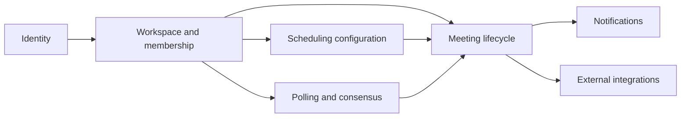
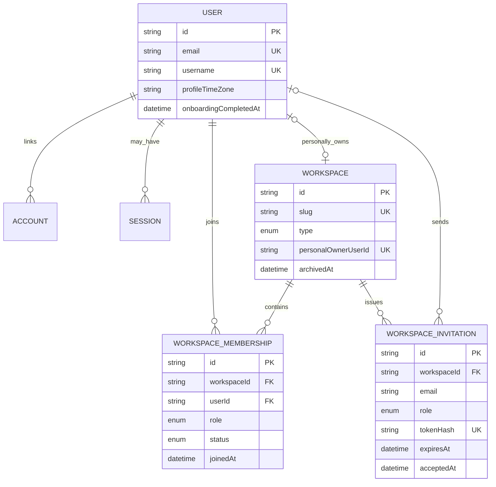
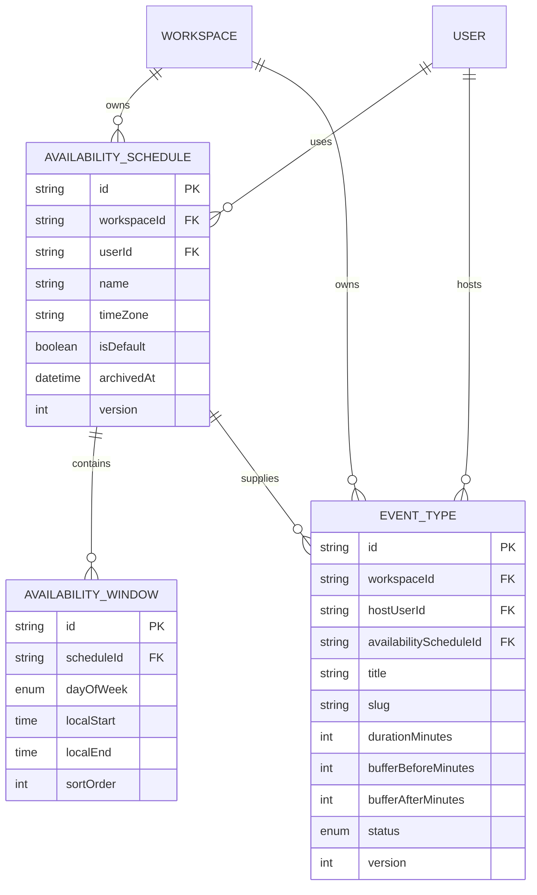
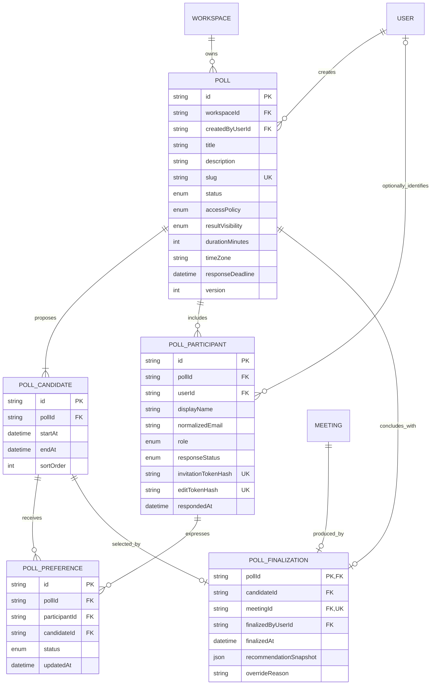
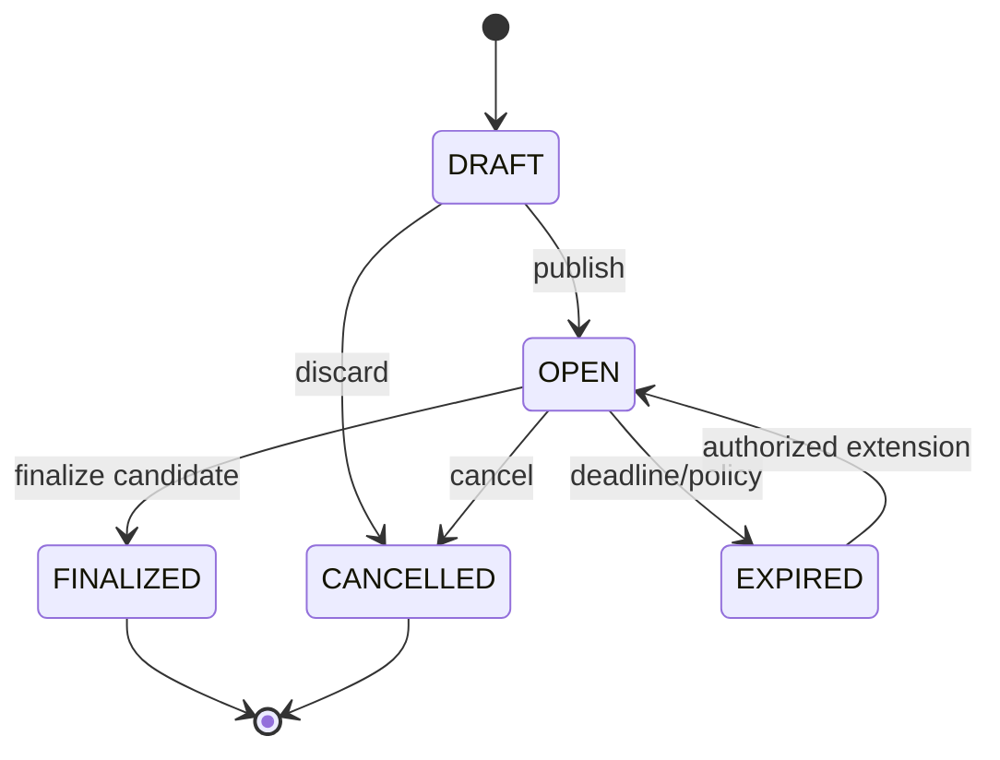
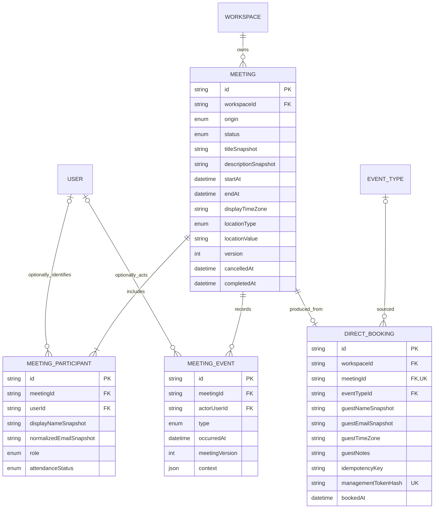
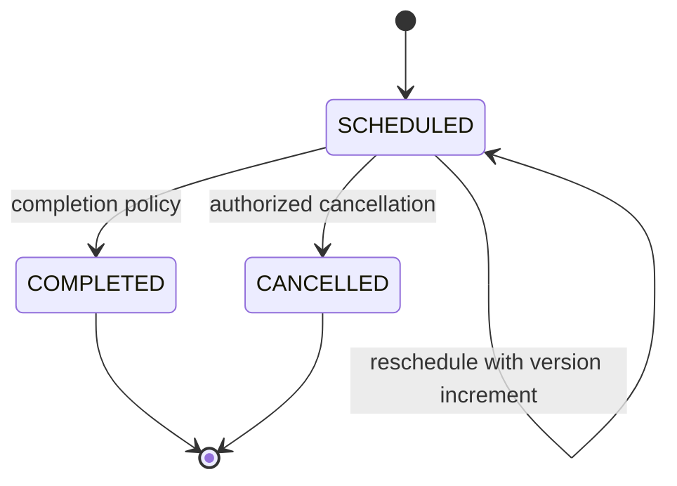
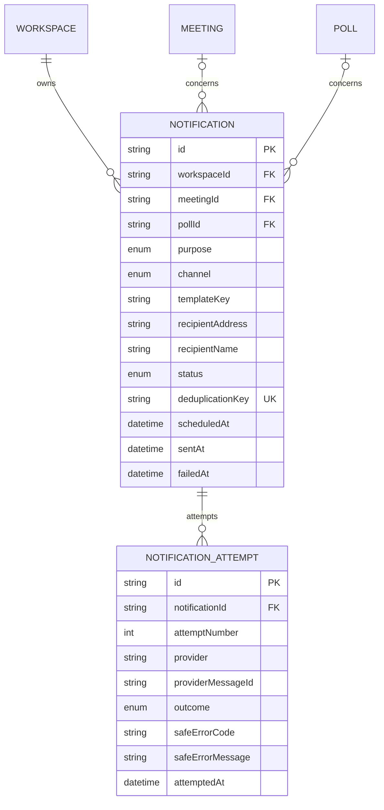
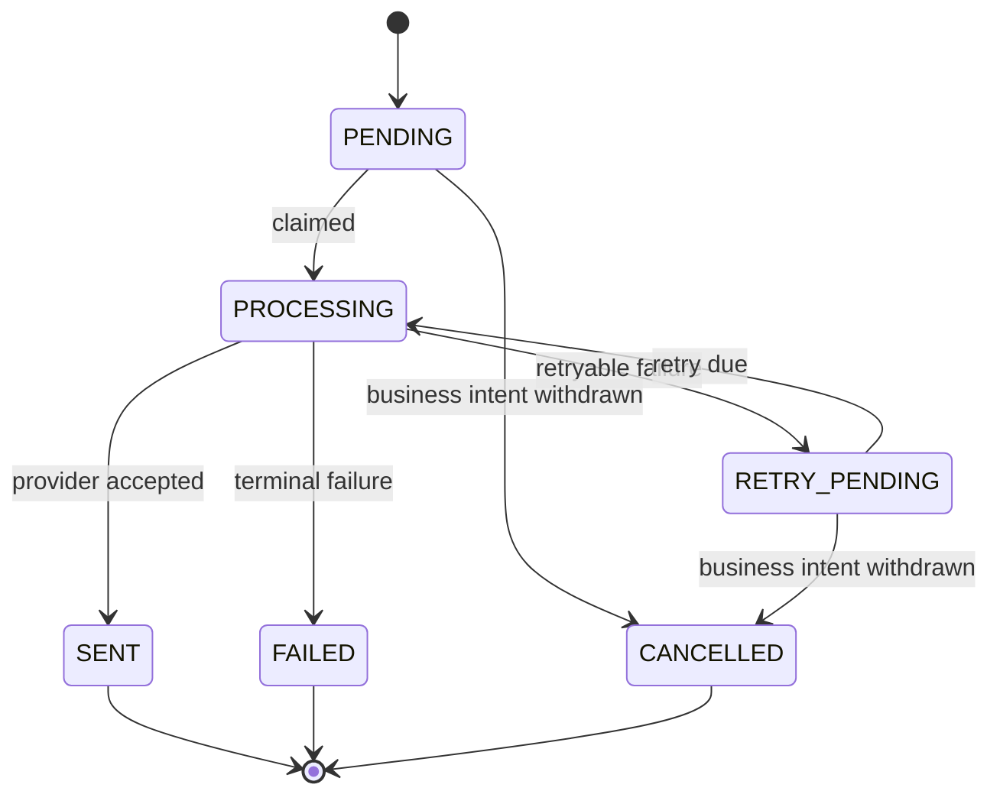
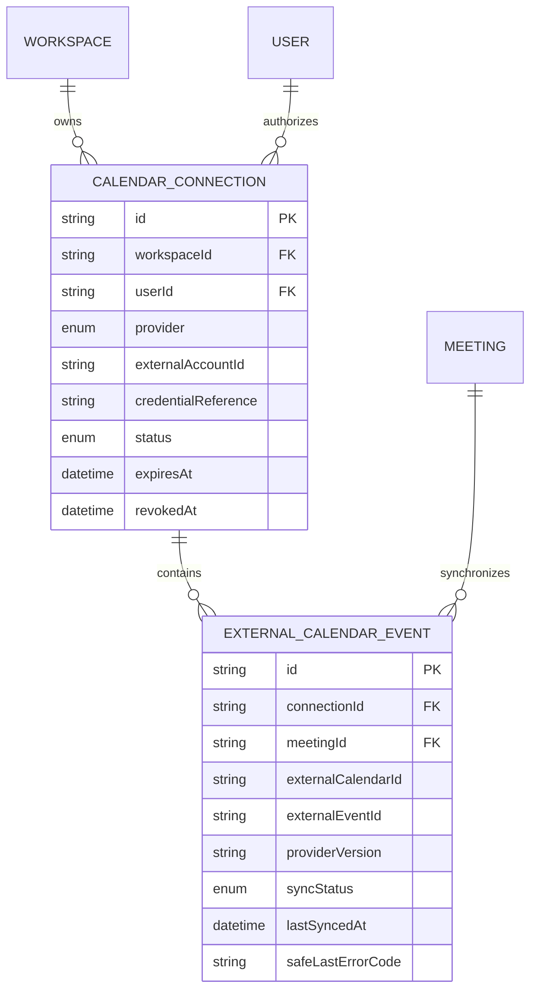

# Proposed Domain and ER Model

**Document status:** Proposed logical design

**Inputs:** Accepted domain directions, user journeys, use cases, business rules, and current-schema audit

**Implementation status:** Not implemented

## Purpose

This document proposes a target relational model for SlotSyncro. It is a logical design used to evaluate domain boundaries, relationships, invariants, transactions, queries, and migration work before editing the Prisma schema.

It is not:

- A claim that these tables already exist
- A final Prisma schema
- Authorization implemented by foreign keys
- A clean-slate rewrite plan
- Permission to migrate production data without validation and rollback planning

## Design goals

The proposed model should:

1. Let direct booking and poll finalization produce one shared meeting lifecycle.
2. Support authenticated and accountless participants without using display names as identity.
3. Establish a workspace ownership boundary while keeping individual UX simple.
4. Make invalid cross-poll votes and finalization references structurally difficult or impossible.
5. Separate recurring local-time rules from absolute scheduled instants.
6. Preserve historical meaning after configuration changes.
7. Keep notification and provider state independent from meeting truth.
8. Support cancellation, rescheduling, audit history, retries, and concurrency.
9. Remain one modular-monolith application with one PostgreSQL database.
10. Provide an incremental migration path from every current product table.

## Accepted modeling decisions

The recommendations in [Proposed domain decisions](./domain-decisions.md) are accepted as inputs to this model, with these qualifications:

- The exact PostgreSQL mechanism for overlap prevention remains unresolved pending an implementation experiment.
- Token hashing, credential encryption, retention periods, and job claiming require detailed system/security design.
- Physical time-of-day representation will be confirmed against Prisma and PostgreSQL behavior.
- Team-workspace UX remains later work even though workspace ownership is modeled now.

## Bounded-context overview



These are module and aggregate ownership boundaries, not microservices.

## Proposed entity catalogue

| Context | Entity | Purpose |
| --- | --- | --- |
| Identity | `User` | Authenticated person and profile identity |
| Identity | `Account`, `Session`, `VerificationToken` | Auth.js infrastructure |
| Workspace | `Workspace` | Personal or team tenant boundary |
| Workspace | `WorkspaceMembership` | User role inside one workspace |
| Workspace | `WorkspaceInvitation` | Pending membership invitation |
| Scheduling | `AvailabilitySchedule` | Named recurring schedule with its own timezone |
| Scheduling | `AvailabilityWindow` | One local weekday time range |
| Scheduling | `EventType` | Reusable direct-booking configuration |
| Polling | `Poll` | Group scheduling decision process |
| Polling | `PollCandidate` | One proposed absolute interval |
| Polling | `PollParticipant` | Poll-scoped authenticated or accountless person |
| Polling | `PollPreference` | Participant preference for one candidate |
| Polling | `PollFinalization` | One authoritative poll decision and resulting meeting |
| Meeting | `Meeting` | Final scheduled commitment and lifecycle root |
| Meeting | `DirectBooking` | Direct-booking source and accepted guest submission |
| Meeting | `MeetingParticipant` | Meeting-scoped host or attendee snapshot |
| Meeting | `MeetingEvent` | Append-only important lifecycle transition |
| Notification | `Notification` | Durable intent to communicate with one recipient |
| Notification | `NotificationAttempt` | One provider delivery attempt |
| Integration | `CalendarConnection` | Authorized external calendar account connection |
| Integration | `ExternalCalendarEvent` | Provider event synchronized with one meeting |

## Identity and workspace ER model



### Workspace invariants

- Every product resource belongs to one workspace.
- A personal workspace has exactly one `personalOwnerUserId`.
- A user has at most one personal workspace.
- Every personal workspace owner has an active `OWNER` membership.
- A user has at most one effective membership per workspace.
- Membership role belongs to the user-workspace relationship, not to `User` globally.
- Team workspaces have no `personalOwnerUserId`; ownership is represented through membership roles.
- Archived workspaces reject new product mutations according to policy.

### Key constraints

| Entity | Constraint | Purpose |
| --- | --- | --- |
| Workspace | Unique `slug` | Workspace route identity |
| Workspace | Unique nullable `personalOwnerUserId` | One personal workspace per user |
| WorkspaceMembership | Unique `(workspaceId, userId)` | One membership per user/workspace |
| WorkspaceInvitation | Unique `tokenHash` | One verifiable invitation token |
| WorkspaceInvitation | Candidate unique active `(workspaceId, normalizedEmail)` | Avoid duplicate active invitations; exact conditional strategy deferred |

### Authorization boundary

Foreign keys prove membership rows exist. Application policy must still evaluate:

- Membership status
- Required role or permission
- Workspace archived state
- Resource ownership
- Action-specific delegation

## Scheduling-configuration ER model



### Availability invariants

- Schedule timezone is a valid IANA timezone.
- Each window has `localStart < localEnd` under the initial same-day-window policy.
- Windows inside one schedule/day do not overlap.
- Full schedule replacement is transactional.
- A default schedule is unique within the selected owner scope.
- Archived schedules cannot be newly assigned to event types.
- Existing event types require a valid replacement before an assigned schedule is archived, or retain an accepted snapshot according to policy.

### Event-type invariants

- Slug is unique within workspace or public scheduling scope.
- Host is an active workspace member.
- Assigned schedule belongs to the same workspace and intended host.
- Duration is 5–480 minutes.
- Buffers are non-negative and bounded by an accepted maximum.
- Archived event types reject new direct bookings.
- Hard deletion is restricted after the event type has produced booking history.

### Time-of-day representation

`localStart` and `localEnd` are logical local wall-clock values. The final Prisma schema must choose among PostgreSQL `time`, integer minute-of-day, or another validated representation after testing:

- Prisma type support
- Sorting and comparison
- Migration from `HH:mm` strings
- DST candidate generation behavior
- Cross-midnight requirements

Initial recommendation: disallow cross-midnight windows and represent them as two weekday windows when needed.

## Polling ER model



### Poll lifecycle



Initial recommendation: a finalized poll does not reopen. Rescheduling creates a new poll related to the meeting.

### Participant semantics

- A `PollParticipant` is scoped to one poll.
- `userId` is optional; accountless participation remains supported.
- Display name is presentation data, not identity.
- Email is stored once per participant, not once per candidate preference.
- Required/optional role influences decision policy.
- Absence of `PollPreference` represents unanswered; it is distinct from `NO`.
- Invitation and edit tokens are stored as hashes and never returned after initial issuance except through the original link-generation response.

### Cross-poll integrity

`PollPreference` includes `pollId` deliberately so the database can enforce composite consistency:

```text
(participantId, pollId) -> PollParticipant(id, pollId)
(candidateId, pollId)   -> PollCandidate(id, pollId)
```

This requires unique candidate keys on `(id, pollId)` for participant and candidate records. The exact Prisma relation syntax must be validated, but the relational invariant is accepted:

> Preference participant and candidate belong to the same poll.

### Finalization integrity

`PollFinalization` is a one-to-one outcome record:

- `pollId` is its primary key, so one poll finalizes once.
- `meetingId` is unique, so one meeting is not the outcome of several poll finalizations.
- Composite candidate/poll relationship proves selected candidate belongs to poll.
- Poll status transition, finalization insert, meeting creation, participants, meeting event, and outbox/notification intent occur in one transaction.

### Poll constraints

| Constraint | Purpose |
| --- | --- |
| Unique `slug` | Public poll identity under current route plan |
| Unique `(pollId, startAt, endAt)` | Prevent duplicate candidates |
| Check `endAt > startAt` | Valid candidate interval |
| Unique `(pollId, normalizedEmail)` when identity policy requires | Prevent duplicate invited email identity; conditional policy required |
| Unique `(participantId, candidateId)` | One effective preference per participant/candidate |
| Composite FKs including `pollId` | Prevent cross-poll preference/finalization references |

## Meeting ER model



### Meeting origin

Initial origin values:

```text
DIRECT_BOOKING
POLL_FINALIZATION
MANUAL
```

Only add origin values backed by an implemented use case.

### Meeting lifecycle



Rescheduling changes the interval, increments version, and appends a `RESCHEDULED` event. It does not require a misleading permanent `RESCHEDULED` current status.

### Meeting invariants

- `endAt > startAt`.
- Workspace owns the meeting.
- Meeting has at least one `HOST` participant.
- Participant user, when present, has valid relationship according to access policy.
- One direct booking produces at most one meeting.
- One poll finalization produces at most one meeting.
- Meeting origin agrees with exactly one accepted source relationship where applicable.
- Cancellation and completion timestamps agree with current status.
- Version increases on lifecycle/schedule mutation.
- External delivery/synchronization failure never rewrites meeting status.

### Participant roles

Initial roles:

```text
HOST
REQUIRED
OPTIONAL
GUEST
```

Whether `GUEST` is meaningfully distinct from required/optional attendance should be reviewed during implementation. Avoid storing two overlapping classifications if one role dimension is insufficient; separate hosting role from attendance requirement if use cases demand it.

### Direct booking snapshots

`DirectBooking` retains accepted guest input and event provenance. `Meeting` retains title, description, and schedule snapshots required for independent historical meaning.

`eventTypeId` should use restrictive or nullable retention behavior rather than cascading meeting deletion. If an event type is exceptionally hard-deleted through a privacy/maintenance process, the snapshot remains interpretable.

### Meeting concurrency

`version` supports optimistic concurrency:

```text
UPDATE Meeting
SET ..., version = version + 1
WHERE id = ? AND version = expectedVersion
```

Zero updated rows means the actor used stale state and must reload.

### Overlap invariant

The logical invariant is:

> Blocking meeting intervals for the same host/resource do not overlap.

Because hosts are represented through `MeetingParticipant`, the physical database constraint may require a dedicated reservation/host-allocation table or another representation suited to PostgreSQL exclusion constraints. This is intentionally unresolved in the logical ER model and requires a focused prototype before final Prisma design.

## Notification ER model



### Notification lifecycle



### Notification invariants

- Notification represents one recipient, channel, purpose, and business occurrence.
- `deduplicationKey` prevents duplicate intent for the same logical occurrence.
- Attempt number is unique per notification.
- Provider message ID is retained when returned.
- Failure details are sanitized and never contain credentials or secret links.
- A notification references a valid subject context. The exact meeting/poll XOR constraint must be represented with a database check or a more general subject design.
- Required notification records are created in the same transaction as the business transition that requires them.

### Outbox decision still required

Two implementation options remain:

1. `Notification` doubles as the durable outbox/work item.
2. A generic `OutboxMessage` is created transactionally and later produces notifications/integration work.

System architecture will select the approach based on deployment, worker, replay, and non-email event requirements.

## Calendar-integration ER model



### Integration invariants

- Provider account identity is unique within the intended connection scope.
- Credentials are encrypted or referenced from an appropriate secret store; never exposed through ordinary model serialization.
- External event identity is unique per connection/calendar.
- One meeting may have several external references when several hosts/calendars are synchronized.
- Webhook or retry reconciliation uses provider IDs and versions rather than meeting title/time matching.
- Connection revocation does not delete the internal meeting.

## Proposed ownership map

| Entity | Tenant owner | Acting user references |
| --- | --- | --- |
| AvailabilitySchedule | Workspace | Schedule user/host |
| EventType | Workspace | Host and creator where needed |
| Poll | Workspace | Creator/finalizer |
| Meeting | Workspace | Participants/actors through related records |
| DirectBooking | Same workspace as meeting | Accountless guest snapshot |
| Notification | Workspace | Recipient snapshot; initiating event actor elsewhere |
| CalendarConnection | Workspace | Authorizing user |

Every resource query must establish workspace scope even when a globally unique ID is used. Global uniqueness is not tenancy authorization.

## Aggregate and transaction boundaries

### Direct booking transaction

```text
Validate resource, availability, authorization, and idempotency
  -> reserve/prevent overlapping interval
  -> create Meeting
  -> create host and guest MeetingParticipants
  -> create DirectBooking source
  -> append MeetingEvent(SCHEDULED)
  -> create required Notification intents
  -> commit
```

External email/calendar delivery occurs after commit.

### Poll response transaction

```text
Validate poll access and OPEN state
  -> resolve PollParticipant
  -> verify all candidates belong to poll
  -> replace/upsert effective PollPreferences
  -> update participant response state/time
  -> commit
```

### Poll finalization transaction

```text
Validate actor, poll version, OPEN state, and candidate
  -> create Meeting and MeetingParticipants
  -> create PollFinalization
  -> update Poll to FINALIZED
  -> append MeetingEvent(SCHEDULED)
  -> create Notification/integration work
  -> commit
```

### Meeting cancellation transaction

```text
Validate actor, status, token/membership, and version
  -> update Meeting to CANCELLED and increment version
  -> append MeetingEvent(CANCELLED)
  -> create notification/calendar-cancellation work
  -> release internal reservation according to model
  -> commit
```

### Meeting rescheduling transaction

```text
Validate actor, availability, status, and expected version
  -> replace interval and increment version
  -> append MeetingEvent(RESCHEDULED) with previous/new interval
  -> create notification/calendar-update work
  -> update/finalize rescheduling poll when applicable
  -> commit
```

## Proposed referential actions

Referential actions should preserve historical commitments by default.

| Relationship | Proposed behavior | Rationale |
| --- | --- | --- |
| User -> Account/session | Cascade | Authentication infrastructure depends on user |
| User -> Membership | Restrict or controlled removal | Workspace ownership transfer may be required |
| User -> participant/actor references | Set null where snapshot exists | Preserve history after account deletion |
| Workspace -> product resources | Restrict routine hard delete; archive first | Avoid accidental tenant-history loss |
| EventType -> DirectBooking | Restrict or SetNull with snapshot | Preserve booking provenance/history |
| Poll -> candidates/participants/preferences | Cascade only during controlled draft deletion; archive otherwise | Published decision history may matter |
| Meeting -> participants/events | Cascade only during controlled hard deletion | These are meeting-owned historical records |
| Meeting -> notification/external references | Preserve or controlled cascade according to retention | Operational history and reconciliation |

Some policies cannot be expressed solely with `onDelete`; deletion should be a use case executed through domain services.

## Access patterns and candidate indexes

Indexes follow expected queries, not entity aesthetics.

| Query | Candidate index |
| --- | --- |
| Find active membership | `WorkspaceMembership(userId, status)` and unique `(workspaceId, userId)` |
| List workspace event types | `EventType(workspaceId, status, createdAt)` |
| Load host schedules | `AvailabilitySchedule(workspaceId, userId, archivedAt)` |
| Load windows by schedule/day | `AvailabilityWindow(scheduleId, dayOfWeek, localStart)` |
| Resolve public event type | Unique `(workspaceId or publicOwnerScope, slug)` based on route decision |
| Resolve public poll | Unique `Poll(slug)` |
| List workspace polls | `Poll(workspaceId, status, createdAt)` |
| Load candidates | `PollCandidate(pollId, startAt)` |
| Track response progress | `PollParticipant(pollId, responseStatus)` |
| Load poll preferences | Unique `(participantId, candidateId)` plus candidate/poll consistency indexes |
| List upcoming meetings | `Meeting(workspaceId, status, startAt)` |
| Find user's hosted/attending meetings | `MeetingParticipant(userId, role, meetingId)` plus meeting join |
| Claim notifications | `Notification(status, scheduledAt)` |
| Load notification attempts | Unique `(notificationId, attemptNumber)` |
| Reconcile provider event | Unique `(connectionId, externalCalendarId, externalEventId)` |

Query plans and data volume should be measured before final index selection. Foreign keys commonly queried for joins need explicit indexes in PostgreSQL unless already covered by a useful unique/composite index.

## Current-to-proposed mapping

| Current model/field | Proposed destination | Migration note |
| --- | --- | --- |
| `User` | `User` | Retain IDs; add onboarding/profile fields as needed |
| User-owned resources | Workspace-owned resources | Create personal workspace and owner membership per user |
| `User.timeZone` | `User.profileTimeZone` | Preserve as display/default preference |
| `UserAvailability` | `AvailabilitySchedule` + `AvailabilityWindow` | Parse JSON slots; create schedule timezone snapshot from current user timezone |
| `EventType.userId` | `EventType.workspaceId` + `hostUserId` | Map to personal workspace; preserve host |
| `Booking` | `Meeting` + `DirectBooking` + participants + initial event | Backfill one meeting per booking; preserve legacy ID mapping |
| `Booking.status` | `Meeting.status` | Map accepted/pending/cancelled through explicit migration policy |
| `googleMeetLink` / general meeting URL branch fields | Meeting location or external integration reference | Classify URL/provider; retain unknown as custom URL |
| `Booking.icsUid` | Stable calendar identity/external reference | Preserve existing UID during migration |
| `Poll` | `Poll` | Add workspace, lifecycle, access, duration, timezone, deadline, version |
| `TimeSlot` | `PollCandidate` | Preserve IDs where practical; validate intervals/duplicates |
| Repeated `Availability` vote rows | `PollParticipant` + `PollPreference` | Group by poll and participant identity heuristic; detect collisions |
| `Availability.userId` | `PollParticipant.userId` | Preserve optional account link |

## Migration risks

### Participant grouping

Current free-form names are not reliable identities. Backfill cannot safely assume that every case-insensitive matching name is one person.

Migration should:

- Group by poll
- Prefer existing `userId` when present
- Use normalized email when consistently present
- Detect conflicting emails/names
- Produce a review/report for ambiguous groups
- Avoid silently merging distinct people

### Schedule JSON quality

Existing JSON may contain fallback windows, invalid ordering, or unexpected shapes. Migration must validate and report before enforcing new constraints.

### Booking overlap

Existing data must be scanned for overlaps before adding an exclusion/reservation constraint. Invalid historical data needs an explicit resolution policy.

### Cascade changes

Changing from cascade to restrict can fail while orphaning assumptions exist in application flows. Delete actions must be changed before the constraint cutover.

### Reconciled email baseline

Stable ICS identity and general meeting provider fields are present in the current schema. Preserve and map them when writing the final migration.

## Incremental migration phases

### Phase 0: Reconcile and inspect

- Merge/reconcile active schema feature branches.
- Back up development/staging data.
- Run data-quality reports for overlaps, invalid windows, duplicate poll identities, and cross-poll votes.
- Freeze final naming and enum mappings for the migration.

### Phase 1: Add workspace ownership

- Add workspace, membership, and invitation tables.
- Create one personal workspace per existing user.
- Backfill workspace IDs onto current resource tables.
- Update authorization/query paths.
- Add non-null constraints only after verification.

### Phase 2: Normalize schedules

- Add schedule/window tables.
- Convert current weekly JSON windows.
- Compare generated candidates between old and new engines.
- Switch reads/writes after parity tests.
- Retire duplicated legacy schedule columns later.

### Phase 3: Introduce meetings for current bookings

- Add meeting, participant, direct-booking source, and event tables.
- Backfill one meeting per booking.
- Preserve booking status, time, guest, event-type snapshot, meeting URL, and calendar identity.
- Temporarily retain legacy booking lookup mapping.
- Switch booking creation to the new transaction.

### Phase 4: Normalize poll participation

- Add poll lifecycle and participant/preference tables.
- Convert candidates and group current votes conservatively.
- Add composite cross-poll constraints.
- Switch voting to participant identity and explicit unanswered behavior.

### Phase 5: Add poll finalization

- Add finalization relationship and state transition.
- Implement poll-to-meeting transaction.
- Add idempotency and concurrency tests.
- Add participant notifications.

### Phase 6: Introduce durable work and integrations

- Add notification/attempt model or generic outbox after system-architecture decision.
- Migrate booking email state where available.
- Add calendar connections and external event references with one provider first.

### Phase 7: Remove legacy structures

- Confirm no active code reads legacy models/columns.
- Run reconciliation reports.
- Remove or rename legacy tables through explicit migrations.
- Update current-domain documentation to match the new implemented model.

## Verification strategy

### Schema verification

- Migration applies to empty and representative populated databases.
- Every backfill reports counts before and after.
- Foreign keys, unique constraints, checks, and indexes exist as designed.
- Rollback or forward-fix procedure is documented per phase.

### Domain verification

- Direct booking creates one meeting and source.
- Concurrent booking attempts cannot violate overlap rules.
- Poll preference cannot reference another poll's candidate.
- Repeated finalization creates one meeting.
- Cancellation/rescheduling preserve lifecycle history.
- User deletion/anonymization follows retention policy.
- Provider failure leaves internal meeting state intact.

### Journey verification

End-to-end tests should cover:

- First-user personal workspace provisioning
- Direct booking success and notification failure
- Open-link and invitation-only poll response
- Poll finalization
- Direct and consensus rescheduling
- Cancellation with provider retry state

## Deferred decisions

- Exact PostgreSQL overlap mechanism
- Exact local-time physical type
- Generic outbox versus notification-as-work-item
- Meeting participant role dimensionality
- Workspace-specific custom domains
- Multiple availability schedules in initial UI
- Multiple calendar providers
- Formal retention durations

Deferred does not mean forgotten; each item has a known decision point before implementation.

## Acceptance checklist

- [ ] Direct booking and poll finalization converge on `Meeting`.
- [ ] `DirectBooking` preserves source-specific guest/provenance data.
- [ ] Poll participant identity no longer depends on name.
- [ ] Composite relationships prevent cross-poll preferences/finalization.
- [ ] Workspace ownership and user actor roles are separate.
- [ ] Schedule timezone is independent of profile timezone.
- [ ] Current status and lifecycle history serve different queries.
- [ ] Configuration deletion cannot casually erase meeting history.
- [ ] Notification and provider state are independent from meeting truth.
- [ ] Every current table has a migration destination.
- [ ] Unresolved physical mechanisms are labelled rather than guessed.

## Related runtime and delivery design

The [system architecture](./system-architecture.md) defines how the modular monolith realizes this model. The [deployment architecture](./deployment-architecture.md) maps it to runtime infrastructure, and the [roadmap](./roadmap.md) defines incremental migration and implementation gates.
