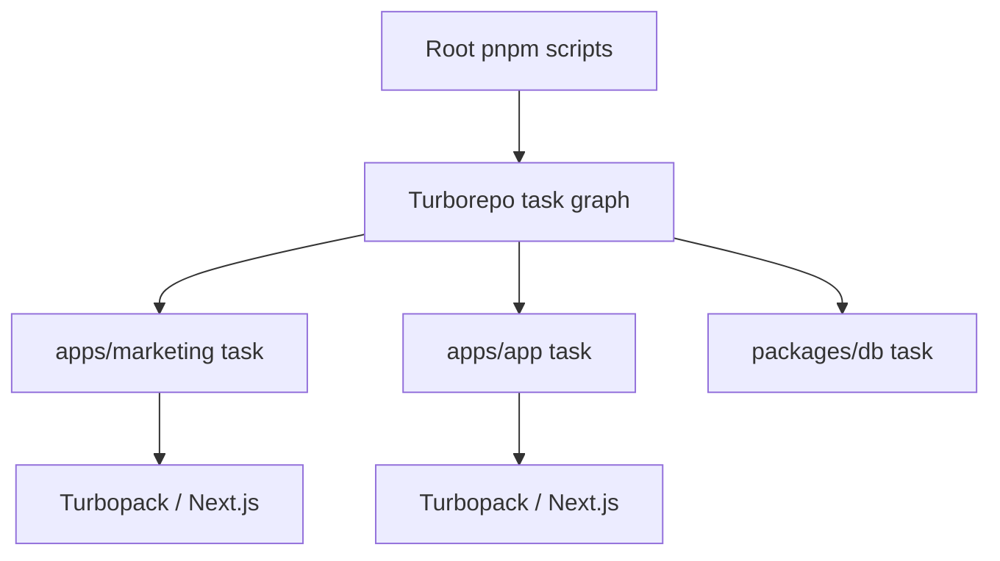
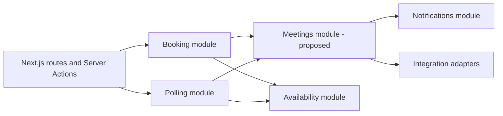
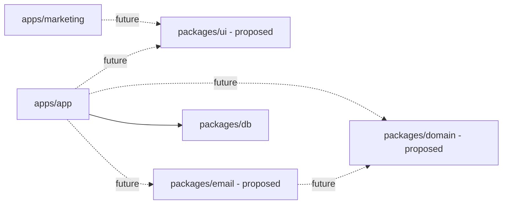

# Repository Architecture

**Document status:** Initial draft  
**Scope:** Current Turborepo structure and proposed package boundaries

## Why a monorepo

SlotSyncro deliberately uses a monorepo because it has independently deployable product surfaces and shared infrastructure:

- A public marketing website
- A dynamic scheduling application
- A shared database package
- Future domain, email, and UI code that may serve more than one consumer

The goal is not to maximize the number of packages. The goal is to make ownership, dependency direction, testing, and deployment boundaries explicit.

## Turborepo and Turbopack

These tools solve different problems:

| Tool | Responsibility |
| --- | --- |
| **Turborepo** | Coordinates workspace tasks, dependency-aware execution, and build outputs across the repository. |
| **Turbopack** | Compiles each Next.js application. Next.js 16 uses it by default for `next dev` and `next build`. |



## Current workspace structure

```text
slotsyncro/
├── apps/
│   ├── app/          # Scheduling product
│   └── marketing/    # Public marketing site
├── packages/
│   └── db/           # Prisma schema and configured database client
├── docs/             # Product and technical design
├── package.json
├── pnpm-workspace.yaml
└── turbo.json
```

The workspace glob includes `apps/*` and `packages/*`.

## Current application responsibilities

### `apps/marketing`

**Current:** A minimal Next.js application running locally on port 3000.

Intended ownership:

- Landing and feature pages
- Public product information
- Search-engine-oriented content
- Legal pages
- Product education
- Calls to action into the product application

It should not own authenticated scheduling workflows or import the database package directly without a reviewed use case.

### `apps/app`

**Current:** The primary Next.js product application running locally on port 3001.

It owns:

- Authentication and account-facing UI
- Dashboard pages
- Event-type management
- Availability configuration
- Public booking flows
- Booking management
- Poll creation and voting
- Server Actions that coordinate product use cases
- Application-specific components

### `packages/db`

**Current:** Shared persistence infrastructure exported as `@repo/db`.

It owns:

- Prisma schema
- Prisma Client configuration
- Neon adapter configuration
- Development client reuse
- Auth.js Prisma adapter factory
- Database generation, push, seed, and Studio scripts

It should not own business workflows such as selecting a winning poll candidate or deciding whether an email failure invalidates a booking.

## Product application architecture

The product application will evolve as a modular monolith. This is an accepted direction, while the physical module folders remain **proposed** and will be introduced incrementally.



The application remains one deployment and uses one PostgreSQL database. Module boundaries represent business ownership, not internal network services.

See [ADR 0001: Adopt a modular monolith](./adr/0001-adopt-modular-monolith.md) for the decision, alternatives, consequences, and migration strategy.

## Current task graph

Root scripts delegate to Turborepo:

| Root command | Turbo task | Purpose |
| --- | --- | --- |
| `pnpm dev` | `dev` | Run persistent application development servers. |
| `pnpm build` | `build` | Build applications after dependency builds and database generation. |
| `pnpm lint` | `lint` | Run lint tasks across participating workspaces. |
| `pnpm db:generate` | `db:generate` | Generate Prisma artifacts. |
| `pnpm db:push` | `db:push` | Synchronize the development database schema. |

Current Turbo behavior includes:

- Persistent, uncached development tasks
- Build dependency on upstream builds and database generation
- Build outputs for `.next` and `dist`
- Environment files included in global task dependencies
- Uncached database mutation/generation tasks

Database mutation tasks must remain uncached because replaying a cached success would not perform the external database operation.

## Dependency direction

The desired rule is: applications compose packages; packages never import applications.



Forbidden directions include:

```text
packages/db      -> apps/app
packages/domain  -> apps/app
packages/ui      -> an application-specific booking component
apps/marketing   -> authenticated dashboard internals
```

## Proposed packages

The following are architectural options, not current workspaces.

### `packages/domain`

Create when scheduling rules have stable, framework-independent APIs or multiple consumers.

Candidate responsibilities:

- Availability slot generation
- Poll consensus calculation
- Timezone inconvenience scoring
- Fairness rules
- Meeting and poll state-transition validation
- Shared domain types and validation schemas

It should not import React, Next.js, Prisma Client, Resend, or provider SDKs.

### `packages/email`

Create after several transactional email workflows exist.

Candidate responsibilities:

- Email templates
- Template input types
- Shared email branding
- Rendering helpers

Provider delivery and business decisions may remain in application use-case services or a later notification service. Rendering an email and deciding when it should be sent are different responsibilities.

### `packages/ui`

Create only when marketing and product applications share a real design system.

Candidate responsibilities:

- Brand tokens
- Typography
- Logo
- General-purpose accessible primitives
- Shared page-shell elements where behavior is genuinely identical

Application workflows such as `BookingView` and `PollVotingForm` should remain in the product application.

### Shared configuration packages

`packages/eslint-config` and `packages/typescript-config` are useful when configuration is intentionally shared and maintained. They should not exist only to make the repository appear larger.

## Package extraction criteria

Extract code only when at least one condition is true:

1. Two or more workspaces need the same capability.
2. The code benefits materially from framework independence.
3. The boundary has stable inputs, outputs, and ownership.
4. Independent tests provide meaningful value.
5. The capability has a different release or deployment concern.

Do not extract when the only benefit is a shorter import path or a larger package count.

## Intended deployment boundary

```text
slotsyncro.com       -> apps/marketing
app.slotsyncro.com   -> apps/app
```

This is **proposed**, not a claim about current deployment.

The separation permits:

- Independent deployments
- Different caching and rendering strategies
- Marketing releases without product deployment
- Stronger separation between public content and authenticated application concerns

## Environment-variable ownership

Environment variables should be scoped to the workspace that consumes them where deployment permits.

Examples:

- Database and application authentication configuration belong to `apps/app` or its runtime environment.
- Prisma CLI configuration may require database variables in `packages/db` during local commands.
- Marketing should not receive database, Resend, or authentication secrets unless it gains an explicit server-side use case.

Repository documentation must list variable names only, never values.

## Open architecture decisions

- Whether domain logic should be extracted before or after the poll-to-meeting lifecycle is implemented.
- Whether email delivery belongs inside `apps/app` long-term or behind a notification service boundary.
- How workspace tenancy changes ownership of existing user-scoped resources.
- Whether marketing and product will use separate domains in initial deployment.
- Whether end-to-end testing should be a root workspace or remain inside `apps/app`.
- Which tasks should participate in remote caching once CI and deployment are formalized.

These decisions should be recorded as ADRs when their implementation becomes imminent.

