# Product and Architecture Roadmap

**Document status:** Proposed delivery plan

**Scope:** Vertical milestones from the current application to the proposed product architecture

**Related documents:** [Feature inventory](./feature-inventory.md), [system architecture](./system-architecture.md), [deployment architecture](./deployment-architecture.md)

## Purpose

This roadmap turns the product, domain, and architecture documents into an implementation sequence. It is organized around user outcomes rather than technical layers: each milestone should leave the application more coherent and demonstrable.

Dates and commercial commitments are intentionally excluded. Priority depends on validated product learning and completion evidence, not an artificial calendar.

## Delivery principles

1. Build one complete vertical slice before broad infrastructure extraction.
2. Preserve existing behavior with characterization tests before changing its model.
3. Treat migrations and backfills as product work, not release afterthoughts.
4. Keep current, partial, and proposed capabilities clearly labelled.
5. Commit internal state before unreliable provider work.
6. Enforce concurrency-sensitive invariants in PostgreSQL.
7. Improve the connected user journey alongside domain changes.
8. Extract packages and services only when evidence supports the boundary.

## Roadmap overview

```mermaid
flowchart LR
    M0[M0 Reconcile and baseline]
    M1[M1 Connected product shell]
    M2[M2 Poll to meeting]
    M3[M3 Direct booking hardening]
    M4[M4 Meeting lifecycle]
    M5[M5 Durable notifications]
    M6[M6 Calendar integration]
    M7[M7 Fair scheduling]
    M8[M8 Collaboration]
    M9[M9 Production validation]

    M0 --> M1 --> M2 --> M3 --> M4 --> M5 --> M6 --> M7 --> M8 --> M9
```



Some work can overlap after its dependencies are stable, but the arrows identify the safest default sequence.

## M0: Reconcile and establish the baseline

### User outcome

The existing booking, poll, authentication, and email behavior has one trustworthy integrated baseline.

### Scope

- Merge or deliberately reconcile the email-invitation work with the target branch.
- Verify Google and GitHub authentication behavior and environment contracts.
- Run the current test/build/lint suite.
- Compare Prisma schema and generated migrations with the current-domain document.
- Classify existing features as current, partial, or proposed from one commit.
- Record known failures and data-quality queries before schema migration.

### Architecture work

- Preserve characterization tests around direct booking and polling.
- Establish stable error-result conventions for Server Actions.
- Add a basic correlation/deploy identifier to server-side diagnostics when deployment work starts.
- Do not reorganize all folders in this milestone.

### Completion evidence

- One branch contains the intended baseline.
- Current documentation matches that commit.
- Booking success and email failure remain separate outcomes.
- Tests and production builds pass from the monorepo root or have documented gaps.

## M1: Create a connected product shell

### User outcome

A new or returning host understands what to do next and can move naturally between direct scheduling and polls.

### Scope

- Add a real dashboard overview.
- Unify navigation for event types, availability, meetings/bookings, and polls.
- Preserve locale across links, redirects, and actions.
- Add consistent loading, empty, success, and error states.
- Add a scheduling-readiness checklist.
- Provide clear poll vote confirmation.
- Improve host-timezone display on management pages.

### Architecture work

- Keep route components focused on composition and reads.
- Introduce shared UI patterns only where repeated behavior exists.
- Define accessibility expectations for keyboard, focus, status announcements, and contrast.

### Completion evidence

- A first-time evaluator can create and share either scheduling resource without guessing the navigation.
- Critical navigation is locale-safe.
- Automated accessibility checks cover primary forms, with a documented manual keyboard pass.

## M2: Deliver the poll-to-meeting vertical slice

### User outcome

An organizer can create a practical multi-date poll, collect identifiable responses, select a candidate, and produce a confirmed meeting.

### Scope

- Add explicit poll lifecycle and access policy.
- Support multiple dates, duration, organizer timezone, and candidate intervals.
- Introduce poll-scoped participants and preferences.
- Support registered and accountless participants securely.
- Distinguish required and optional participants.
- Add poll management and response progress.
- Finalize one candidate into one shared `Meeting`.
- Lock further responses after finalization.

### Domain and data work

- Introduce `PollCandidate`, `PollParticipant`, and `PollPreference` relationships.
- Prevent cross-poll participant/candidate references structurally.
- Introduce `Meeting`, `MeetingParticipant`, `MeetingEvent`, and `PollFinalization`.
- Make repeated/concurrent finalization produce one outcome.
- Create personal workspaces as the invisible ownership boundary if required by the selected migration slice.

### Modular-monolith work

Use this as the first intentionally modular slice:

```text
Polling.finalizePoll()
  -> Meetings.createFromPoll()
  -> record follow-up work
```

Server Actions remain delivery adapters; application services own authorization and the transaction.

### Completion evidence

- A tampered response cannot vote on another poll's candidate.
- A double-click or concurrent finalization creates one meeting.
- The meeting contains the selected interval and participant snapshots.
- End-to-end coverage proves create, respond, finalize, and view-confirmation journeys.

## M3: Harden direct booking onto the meeting model

### User outcome

A guest can reserve a valid time exactly once, and the host sees the same meeting model produced by polls.

### Scope

- Make submitted-slot validation authoritative at submission time.
- Apply event-type duration and buffers consistently.
- Reject past slots and enforce notice-window rules.
- Validate IANA timezones.
- Add request idempotency.
- Preserve booking provenance through `DirectBooking`.
- Create the shared `Meeting`, participants, and lifecycle event.

### Database decision gate

Prototype and select the PostgreSQL host-overlap mechanism before migration. Record the selected approach in an ADR because it is concurrency-sensitive and expensive to reverse.

### Completion evidence

- Concurrent overlapping attempts cannot both succeed.
- Retrying the same logical submission returns one booking outcome.
- Direct booking and poll finalization produce the same meeting lifecycle shape.
- DST and timezone-boundary tests cover representative transitions.

## M4: Complete the meeting lifecycle

### User outcome

Hosts and authorized participants can understand, cancel, and reschedule meetings without contradictory internal or calendar state.

### Scope

- Replace the incomplete bookings list with meeting list and detail views.
- Add upcoming, past, and cancelled filters.
- Add authorized cancellation with actor, timestamp, and reason.
- Add direct rescheduling while preserving meeting identity and history.
- Add consensus rescheduling through a related poll.
- Add optimistic concurrency for meeting changes.
- Archive configuration instead of cascading away history.

### Completion evidence

- Cancellation stops blocking availability according to policy.
- Concurrent edits do not silently overwrite newer state.
- Rescheduling preserves previous schedule history and stable calendar identity.
- Abandoning a rescheduling poll leaves the current meeting unchanged.

## M5: Introduce durable notifications

### User outcome

Invitations, updates, cancellations, and retries are reliable and their delivery state is visible without changing meeting truth.

### Scope

- Add `Notification` and `NotificationAttempt` persistence.
- Record notification intent in the business transaction.
- Select and implement the Vercel-compatible worker trigger.
- Add idempotent provider delivery and bounded retry.
- Support host and participant notifications.
- Preserve ICS UID and correct sequence/status for lifecycle changes.
- Add authorized manual retry for terminal failures.
- Add delivery monitoring and safe failure details.

### Decision gate

Evaluate notification-as-work-item with Vercel Cron, Vercel Queues, and other appropriate mechanisms. Record an ADR if choosing a generic outbox or a deeper platform commitment.

### Completion evidence

- Provider outage does not roll back or duplicate a meeting.
- A crashed worker can safely retry claimed work.
- Repeated processing does not send a new logical notification unintentionally.
- Operational views expose pending age and terminal failures.

## M6: Add external calendar and conferencing integration

### User outcome

Hosts can avoid external calendar conflicts and synchronize confirmed meetings without losing SlotSyncro's internal authority.

### Scope

- Add calendar authorization separately from login consent.
- Read free/busy data with minimal scopes.
- Include external conflicts in candidate generation.
- Create, update, and cancel external calendar events idempotently.
- Add conferencing-link provider support through an adapter.
- Verify, deduplicate, and reconcile provider webhooks.
- Encrypt persisted provider refresh tokens.

### Completion evidence

- Revoked provider access degrades safely.
- A missed or duplicated webhook does not corrupt meeting state.
- Reconciliation detects and repairs recoverable drift.
- Provider-specific fields stay outside the core meeting model.

## M7: Deliver explainable fair scheduling

### User outcome

Groups receive recommendations that account for preferences, required attendance, and timezone inconvenience—and can understand the ranking.

### Scope

- Define and test a timezone inconvenience model.
- Add participant working-hour preferences.
- Generate smarter candidates from duration, availability, calendars, and buffers.
- Rank candidates using explicit required/optional participant policy.
- Explain recommendation factors in the UI.
- Evaluate rotating burden for recurring cross-timezone groups.
- Measure recommendation usefulness rather than claiming fairness from a score alone.

### Completion evidence

- Identical inputs produce deterministic rankings.
- Explanations match the actual scoring inputs.
- DST and unusual timezone offsets are tested.
- User research or structured feedback evaluates whether recommendations feel useful and fair.

## M8: Add collaboration when ownership demands it

### User outcome

Multiple authenticated people can manage shared scheduling resources with clear roles and history.

### Scope

- Expose team workspace creation only after shared ownership use cases are validated.
- Add memberships, invitations, role changes, expiration, and revocation.
- Move selected event types, schedules, polls, and meetings to workspace ownership.
- Add audit history for administrative changes.
- Define deletion, departure, and ownership-transfer policies.

Personal workspaces should exist earlier as an invisible tenancy boundary; this milestone is about exposing collaboration UX, not retrofitting ownership from scratch.

### Completion evidence

- Every workspace mutation enforces role policy in the application service.
- Removing a member has a defined effect on owned and assigned resources.
- Invitation tokens are hashed, expiring, purpose-limited, and revocable.
- Administrative changes have sufficient audit history.

## M9: Validate production operation

### User outcome

The product remains trustworthy through releases and recoverable failures.

### Scope

- Configure separate Vercel projects for marketing and product.
- Isolate preview and production databases and provider credentials.
- Execute reviewed, serialized production migrations.
- Add deployment smoke tests for critical journeys.
- Define service indicators and actionable alerts.
- Enable managed backups and point-in-time recovery.
- Set initial RTO and RPO.
- Run and document a restore/reconciliation exercise.
- Review privacy, retention, rate limiting, and public-endpoint abuse controls.

Deployment begins before this milestone; this milestone proves the operational guarantees rather than merely obtaining a public URL.

### Completion evidence

- A preview cannot mutate production data.
- A production migration has a documented verification and recovery path.
- A restore exercise meets or informs the stated recovery targets.
- Failed notification/calendar work is observable and recoverable.
- Critical user journeys are verified after deployment.

## Cross-cutting test strategy

Each milestone selects the lowest-cost test that provides credible evidence:

| Risk | Required evidence |
| --- | --- |
| Pure business calculation | Unit tests |
| Authorization and orchestration | Application-service tests |
| Constraint, migration, or transaction | Real PostgreSQL integration tests |
| Provider mapping/signature | Adapter contract tests |
| Critical user outcome | End-to-end tests |
| Concurrency | Purpose-built parallel integration test |
| Accessibility | Automated checks plus manual keyboard/screen-reader review where relevant |
| Recovery | Operational exercise and reconciliation report |

Coverage percentage is supporting information, not proof that important risks are tested.

## Documentation and decision gates

Before each milestone implementation:

1. Confirm the user journey and use-case scope.
2. Resolve business-rule questions that block correctness.
3. Update the logical/physical data design.
4. Record an ADR for long-lived, cross-cutting, expensive decisions.
5. Define migration and test evidence.

After implementation:

1. Update feature statuses and current-domain documentation.
2. Check that proposed statements are not presented as shipped behavior.
3. Record measured outcomes, limitations, and follow-up work.
4. Capture a content opportunity only when the lesson is reusable and evidence is safe to publish.

## Recommended immediate backlog

The first executable backlog after this documentation checkpoint is:

1. Reconcile the email-invitation branch and main.
2. Run and document the baseline validation suite.
3. Fix dashboard/navigation and locale continuity.
4. Write the poll-to-meeting migration proposal against the reconciled schema.
5. Implement the poll-to-meeting application service and transaction.
6. Add database and end-to-end tests for cross-poll integrity and repeated finalization.

## Explicitly deferred

- Billing and monetization
- Public API and general outgoing webhooks
- Embeddable scheduler
- Custom domains
- Multiple external calendar providers
- Automatic poll finalization
- Quorum-heavy governance rules
- Independent microservices

Deferred capabilities may be reconsidered after core scheduling, lifecycle, reliability, and product coherence are demonstrated.

## Roadmap acceptance checklist

- [ ] Milestones deliver user outcomes rather than isolated technical layers.
- [ ] Poll and direct-booking paths converge on the shared meeting lifecycle.
- [ ] Concurrency and migration decisions occur before risky schema implementation.
- [ ] UX coherence is improved before adding broad feature depth.
- [ ] External-provider reliability is separated from internal business truth.
- [ ] Workspace collaboration follows a stable ownership boundary.
- [ ] Fairness claims require explainable logic and user evidence.
- [ ] Production readiness includes recovery exercises, not only deployment.
