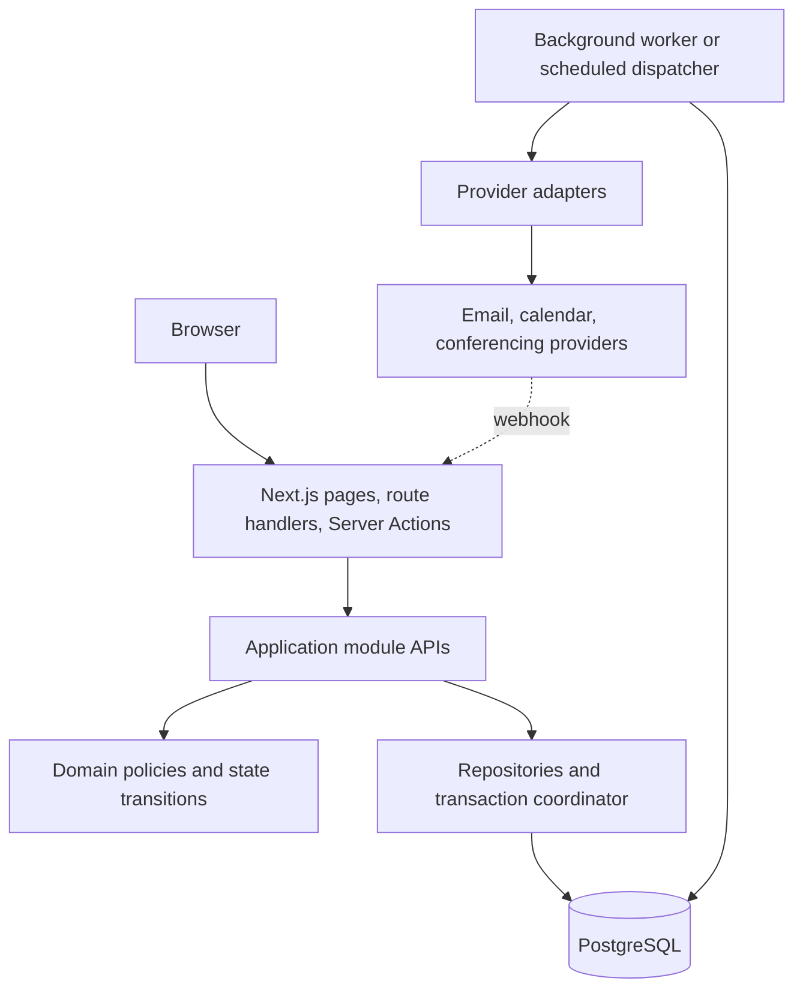
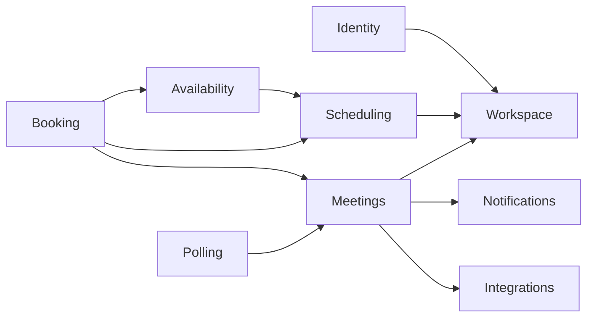
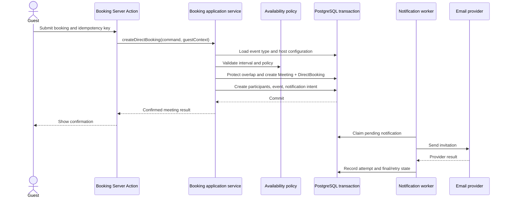
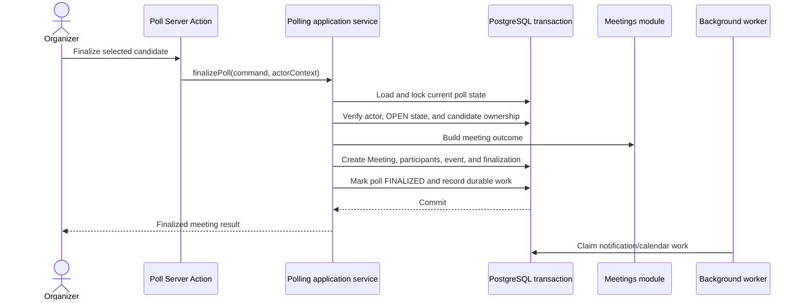
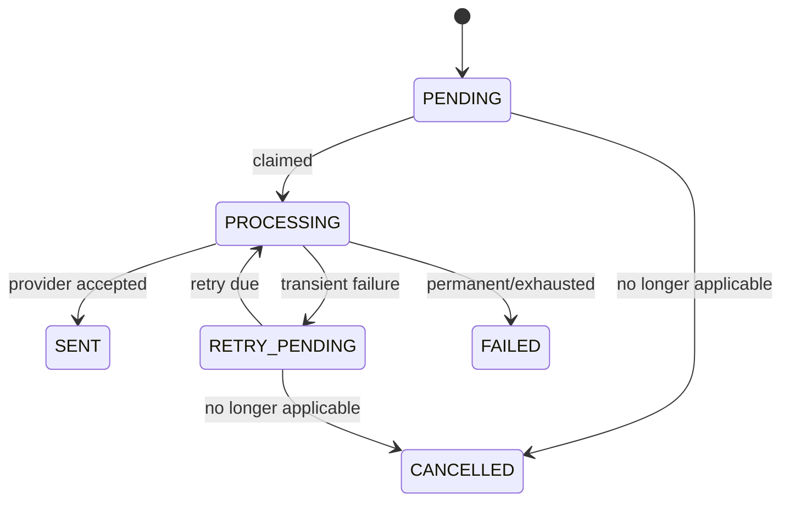

# Proposed System Architecture

**Document status:** Proposed runtime design

**Scope:** How the modular monolith executes SlotSyncro use cases

**Related decisions:** [ADR 0001](./adr/0001-adopt-modular-monolith.md), [proposed domain model](./domain-model-proposed.md)

## Purpose

The domain model defines the information SlotSyncro must preserve. This document defines how requests, business rules, database transactions, and external providers cooperate to preserve it.

This is a target architecture, not a claim that every boundary already exists in code. The current application has Server Actions that combine several responsibilities. Migration will happen one vertical slice at a time.

## Architectural style

`apps/app` is one deployable Next.js modular monolith backed by one PostgreSQL database. Modules are logical ownership boundaries inside the process, not separately deployed services.



The boundaries have different responsibilities:

| Boundary | Owns | Must not own |
| --- | --- | --- |
| Delivery | Transport parsing, authentication context, invoking a use case, mapping results | Core business rules or scattered Prisma mutations |
| Application | Use-case orchestration, authorization, transaction scope, idempotency | React rendering or provider SDK details |
| Domain | Invariants, policies, value objects, state transitions | Next.js, Prisma, Resend, or HTTP concepts |
| Persistence | Queries, writes, database constraint translation | Product policy decisions |
| Integration | Provider request/response mapping, signatures, external IDs | Authority over internal meeting truth |

## Module map and ownership



The arrows show allowed use-case dependencies, not database foreign keys. Cycles are design feedback. If two modules need each other, move the shared decision to the module that owns the business outcome or coordinate them from an application-level use case.

| Module | Public responsibilities |
| --- | --- |
| Identity | Resolve the authenticated actor and account identity |
| Workspace | Authorize workspace roles and manage membership |
| Scheduling | Manage event types and scheduling configuration |
| Availability | Generate bookable intervals and evaluate conflict inputs |
| Booking | Validate and accept a direct-booking request |
| Polling | Create polls, record preferences, recommend and finalize a candidate |
| Meetings | Create, cancel, reschedule, and read the scheduled commitment |
| Notifications | Record delivery intent and manage delivery lifecycle |
| Integrations | Synchronize calendar/conferencing state through provider adapters |

Modules should expose use-case-oriented operations rather than their tables:

```ts
// Illustrative contracts, not committed source code.
createDirectBooking(command, context)
recordPollPreference(command, context)
finalizePoll(command, context)
cancelMeeting(command, context)
```

An API such as `updateMeetingRow()` would expose persistence rather than business intent and make invariants easier to bypass.

## Request and use-case flow

For a state-changing request:

```text
UI
  -> Server Action or route handler
  -> parse and validate transport input
  -> establish actor and request context
  -> call one application use case
  -> authorize against the owned resource
  -> execute domain rules inside a database transaction
  -> return a typed result
  -> update UI or revalidate affected reads
```

### Delivery adapters

Server Actions are appropriate for application-owned browser mutations. Route handlers remain useful for:

- Provider webhooks
- Public machine-facing endpoints
- OAuth callbacks handled by the authentication integration
- Background-job endpoints when the deployment platform requires them

Delivery adapters should:

- Validate untrusted input
- Construct an explicit actor/request context
- Call one application operation
- Translate expected failures into stable result codes
- Avoid exposing raw database or provider errors

Client components should never import Prisma or provider SDKs.

### Application services

An application service coordinates a complete use case. For example, poll finalization must verify authorization and poll state, select a candidate, create the meeting outcome, preserve lifecycle history, and record durable follow-up work.

Application services may call several module-owned policies, but the caller sees one atomic operation.

### Domain policies

Domain code represents rules such as:

- A candidate must belong to the poll being finalized.
- A finalized poll cannot be finalized again.
- A meeting end must be later than its start.
- An unanswered poll candidate is not equivalent to a `NO` preference.
- External delivery failure does not cancel a confirmed meeting.

Pure policies should be testable without Next.js or a database. Rules dependent on current persisted state are completed inside the transaction that changes that state.

## Persistence and transaction management

`packages/db` continues to own Prisma configuration and schema generation. Product modules own the meaning of their data and access it through focused repository/query functions.

Repositories are useful when they:

- Give a business operation a stable persistence interface
- Centralize a non-trivial query or locking strategy
- Prevent another module from mutating owned records directly
- Translate known database constraint failures into application errors

They should not become generic wrappers around every Prisma method.

### Transaction rule

One business decision that must be all-or-nothing uses one local database transaction. Do not include slow network calls inside that transaction.

```text
Inside transaction
  -> authorize against current state
  -> re-check mutable invariants
  -> write aggregate state and lifecycle event
  -> write notification/integration work
  -> commit

After commit
  -> worker claims durable work
  -> call external provider
  -> record success or retryable/permanent failure
```

Database constraints remain the final protection for concurrency-sensitive invariants. Pre-checks improve error messages but do not replace unique, foreign-key, check, or overlap constraints.

## Direct-booking sequence



The user receives a confirmed meeting after internal state commits. Email status is reported separately; a provider timeout must not create a second booking when the request is retried.

## Poll-finalization sequence



Poll status, finalization, and meeting creation belong to the same transaction. Repeating the command must return the existing outcome or a stable already-finalized result, never create a second meeting.

## Durable background work

The initial recommended design is **notification-as-work-item**:

- `Notification` stores the durable intent and lifecycle.
- `NotificationAttempt` stores each provider attempt.
- A worker atomically claims eligible notifications.
- Retry timing and attempt limits are explicit.
- A stable idempotency key prevents duplicate logical work.

This is simpler than introducing a generic event outbox before multiple reliable consumers exist. Adopt a generic outbox later if calendar synchronization, analytics, webhooks, or other consumers need the same committed domain events independently.



Worker claims must use a lease or equivalent atomic update so crashed workers do not leave work permanently stuck and concurrent workers do not deliver the same item intentionally.

## Integrations and provider adapters

Internal contracts must use SlotSyncro concepts. Adapters translate those contracts to Resend, Google Calendar, or future providers.

```text
Notification use case -> EmailSender interface -> Resend adapter
Calendar sync use case -> CalendarProvider interface -> Google adapter
```

Provider IDs, payload fragments, sync tokens, and errors belong to integration-owned records. `Meeting` remains authoritative for SlotSyncro scheduling state.

### Webhooks

A provider webhook handler must:

1. Preserve the raw request long enough to verify its signature.
2. Reject invalid or stale requests.
3. Deduplicate by provider event ID.
4. Resolve the relevant integration record.
5. Apply an allowed state transition through an application use case.
6. Return promptly; defer slow secondary work.

A webhook is evidence from a provider, not permission to bypass workspace authorization or meeting lifecycle rules.

## Authentication and authorization

Authentication answers **who is acting**. Authorization answers **whether that actor may perform this operation on this resource**.

The application uses explicit actor contexts:

```text
AuthenticatedActor(userId, session metadata)
GuestActor(verified capability/token claims)
SystemActor(job or verified provider webhook)
```

### Workspace authorization

Authenticated operations resolve the resource's workspace and require an active membership with sufficient role. A user ID on a session proves identity, not ownership of every supplied record ID.

Authorization should occur in the application service using records loaded for the mutation. UI visibility checks improve experience but are not security controls.

### Accountless access

Public booking and poll participation must not gain broad access merely from knowing a slug or record ID.

- Public slugs identify a resource; policy determines what is publicly readable or writable.
- Invitation-only access uses random, expiring, purpose-limited tokens.
- Store token hashes, not reusable plaintext tokens.
- Compare tokens safely and support revocation/rotation.
- An edit token grants only the stated participant operation, not workspace membership.

## Idempotency and concurrency

Idempotency means safely repeating the same logical command. It is required where browsers, workers, or providers may retry.

Candidate operations include:

- Direct booking creation
- Poll finalization
- Notification delivery
- Calendar event creation
- Webhook consumption

Use a stable operation key plus a uniqueness constraint. The same key with incompatible payload data must be rejected rather than silently reused.

Optimistic versioning can protect ordinary meeting edits. Booking overlap requires a database-backed mechanism designed in the physical schema; a read-then-create check alone is unsafe under concurrency.

## Error model

Expected failures should have stable application codes while logs retain technical detail.

| Category | Example | User-facing behavior |
| --- | --- | --- |
| Validation | End before start | Explain the field problem |
| Authentication | Missing/expired session | Request sign-in or token renewal |
| Authorization | Non-member finalizes poll | Deny without revealing private data |
| Conflict | Slot taken or version stale | Refresh choices and retry intentionally |
| Not found | Unknown public slug | Neutral not-found response |
| Provider | Email temporarily unavailable | Preserve meeting and expose delivery state where useful |
| Unexpected | Database/runtime defect | Generic response plus traceable internal error |

Do not return raw Prisma or provider errors to clients.

## Observability

Every request and background attempt should carry a correlation ID. Structured logs should include safe identifiers and transitions, not secrets or full personal payloads.

Minimum useful signals:

- Use-case success, expected failure category, and latency
- Transaction conflicts and database-constraint failures
- Notification queue depth, oldest pending age, attempts, and terminal failures
- Provider latency and error category
- Webhook signature failures and duplicate counts
- Meeting/poll lifecycle transitions with actor category

Audit history such as `MeetingEvent` serves product and support questions. Operational logs and metrics serve system diagnosis. Neither replaces the other.

## Security boundaries

- Browser input, public URLs, provider callbacks, and job triggers are untrusted boundaries.
- Secrets stay in server runtime configuration and are never passed to client components.
- Personally identifiable information is minimized in logs and provider metadata.
- Provider OAuth tokens require encryption at rest and restricted access paths.
- Rate limits apply to public booking, poll participation, token verification, and webhook endpoints.
- Database access remains server-only.

## Proposed physical organization

```text
apps/app/
├── app/                         # Next.js delivery adapters
├── components/                  # Shared and route-composed UI
└── modules/
    ├── booking/
    │   ├── actions/             # Optional module-local delivery adapters
    │   ├── application/         # Use cases and ports
    │   ├── domain/              # Rules/value objects when complexity warrants
    │   ├── infrastructure/      # Prisma/provider implementations
    │   └── tests/
    ├── polling/
    ├── meetings/
    ├── notifications/
    └── integrations/
```

This is a direction, not a requirement to create every folder immediately. Begin with a public use-case function and colocated tests; add layers when they isolate real complexity.

## Testing by boundary

| Test type | Primary confidence |
| --- | --- |
| Pure unit | Domain rules, scoring, state transitions, value objects |
| Application service | Authorization, orchestration, stable errors, idempotent behavior |
| Database integration | Constraints, transactions, locking, indexes, repository mappings |
| Adapter contract | Provider translation, signatures, error classification |
| End-to-end | Critical user journeys across UI, server, and database |

Mocks are useful at provider boundaries. Database invariants and concurrency behavior require a real PostgreSQL integration environment.

## Incremental adoption

1. Preserve current behavior and add characterization tests.
2. Implement poll finalization as the first explicit modular vertical slice.
3. Introduce the shared `Meeting` outcome and transaction boundary.
4. Record notification intent transactionally and move delivery behind an adapter.
5. Move direct booking onto the same meeting/notification path.
6. Add workspace authorization when workspace persistence is introduced.
7. Add calendar synchronization through the integration boundary.
8. Introduce import-boundary linting only after module APIs stabilize.

Avoid a repository-wide folder rewrite. Architecture becomes credible when one complete use case follows the boundaries and is verified.

## Decisions and deferred mechanisms

This document recommends notification-as-work-item for the first durable worker. Before implementation, record an ADR if the design changes to a generic outbox.

Still requiring focused design or prototypes:

- Physical PostgreSQL meeting-overlap protection
- Worker runtime and deployment trigger
- Lease duration, retry schedule, and dead-letter handling
- Calendar conflict ingestion and webhook reconciliation
- OAuth token encryption/key-management mechanism
- Formal rate-limit storage and thresholds

## Acceptance checklist

- [ ] Every mutation enters through a delivery adapter and one application use case.
- [ ] Module ownership and dependency direction are explicit and acyclic.
- [ ] Core business state commits without waiting for external providers.
- [ ] Durable work is written in the same transaction as the state that requires it.
- [ ] Retried booking and finalization commands cannot duplicate outcomes.
- [ ] Authenticated and accountless authorization paths are explicit.
- [ ] Provider adapters cannot redefine internal meeting truth.
- [ ] Expected failures use stable application codes.
- [ ] Logs, lifecycle history, and delivery attempts serve distinct purposes.
- [ ] Tests cover domain, database, provider, and end-to-end boundaries proportionately.

## Related deployment and delivery plan

The [deployment architecture](./deployment-architecture.md) maps these runtime boundaries to Vercel, PostgreSQL, worker, provider, and operational concerns. The [roadmap](./roadmap.md) sequences their incremental adoption.
