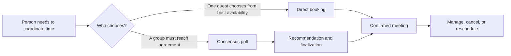
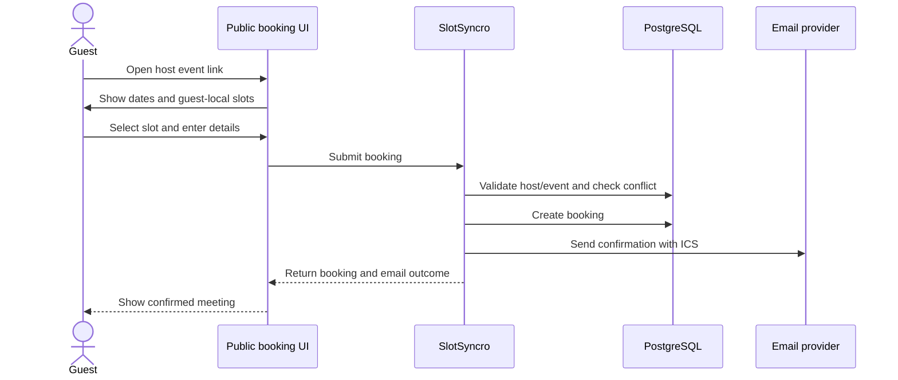
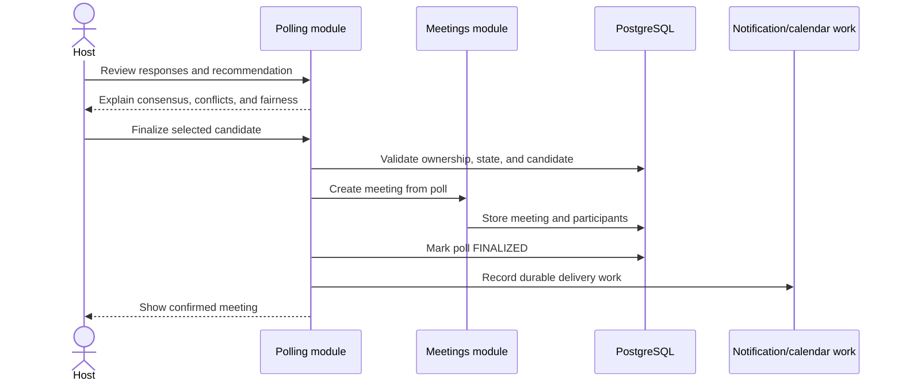

# User Journeys

**Document status:** Initial draft  
**Scope:** Current journeys, known breaks, and proposed target journeys

## Purpose

A user journey describes the outcome a person is trying to reach across several interactions. It is broader than a screen and less technically precise than a use case.

Journeys help answer:

- Why does the user enter the product?
- Which steps must feel connected?
- Where does the current experience stop prematurely?
- Which handoffs require durable data or notifications?
- What must the later use cases and domain model support?

This document does not define database tables. It provides the evidence from which business rules and entities will be derived.

## Journey status

| Label | Meaning |
| --- | --- |
| **Current** | The journey can be completed in the present application. |
| **Partial** | Some steps work, but the intended outcome or recovery path is incomplete. |
| **Proposed** | Target experience to be designed and implemented later. |

## Actors and roles

An actor is a role participating in a journey. It is not automatically a database entity.

| Actor | Description | Account required? |
| --- | --- | --- |
| Visitor | Unauthenticated person exploring SlotSyncro | No |
| User | Authenticated account holder | Yes |
| Host | Person responsible for an event type, poll, or meeting | Usually |
| Guest | Person reserving time through a direct-booking link | No |
| Poll participant | Person expressing preferences in a poll | Not currently |
| Required participant | Proposed participant whose availability can block finalization | Not necessarily |
| Optional participant | Proposed participant whose availability informs but does not block a decision | Not necessarily |
| Workspace member | Proposed user collaborating within a personal or team workspace | Yes |
| Workspace administrator | Proposed member managing access and shared resources | Yes |
| Background system | Proposed scheduled processing for deadlines, reminders, and retries | Not applicable |
| Email provider | External system delivering transactional email | Not applicable |
| Calendar provider | Proposed external source of free/busy data and calendar events | Not applicable |

The same person can hold several roles. A user may be the host of one poll and a participant in another. Role and identity must therefore remain separate concepts.

## Journey map



The central product goal is for both scheduling paths to converge on a reliable meeting outcome.

---

## J-01: First authentication and onboarding

**Current status:** Partial  
**Primary actor:** Visitor becoming a user  
**Goal:** Reach a useful scheduling setup after the first authentication

### Current journey

```text
Visitor opens SlotSyncro
  -> chooses OAuth sign-in
  -> provider authenticates the visitor
  -> Auth.js creates or retrieves the user
  -> user returns to the application
  -> user sees the signed-in home experience
```

### Current friction

- First sign-in and returning sign-in are not presented as distinct experiences.
- There is no guided username selection.
- Timezone and initial availability are not confirmed during onboarding.
- The user is not guided toward creating an event type or poll.
- The header references a dashboard route that does not currently exist.
- A new user can reach several empty states without understanding the recommended order.

### Proposed target journey

```text
Visitor selects Get started
  -> authenticates with an OAuth provider
  -> system detects incomplete onboarding
  -> user confirms display name
  -> chooses a public username
  -> confirms timezone
  -> configures initial weekly availability
  -> chooses Direct booking or Group scheduling
  -> creates the first scheduling resource
  -> reaches the relevant dashboard with a shareable result
```

### Meaningful completion

The user should leave onboarding with at least one usable scheduling resource, not merely an account record.

### Later design questions

- Is onboarding considered complete before or after the first resource is created?
- Is a personal workspace created at account creation or onboarding completion?
- What happens when an OAuth provider does not supply a usable name or email?
- How are username conflicts and reserved names handled?

---

## J-02: Configure direct scheduling

**Current status:** Current with partial management experience  
**Primary actor:** Host  
**Goal:** Produce a public link through which guests can reserve valid time

### Current journey

```text
Host signs in
  -> configures weekly availability and timezone
  -> creates an event type
  -> receives a public slug
  -> copies or opens the booking link
  -> shares the link outside SlotSyncro
```

### What works

- Weekly availability supports multiple windows per day.
- Event types contain title, duration, description, slug, and buffers.
- Event types can be activated, deactivated, and deleted.
- The host can copy or open a public booking link.

### Current friction

- Availability and event-type setup are separate pages without a guided sequence.
- The UI does not clearly indicate whether a new event type has usable availability.
- Public slot generation currently does not apply the event type's configured buffers.
- Link construction and navigation do not consistently preserve locale.
- There is no preview mode that avoids creating a real booking.

### Proposed improvement

Present a scheduling-readiness checklist:

```text
✓ Public identity configured
✓ Timezone confirmed
✓ Weekly availability configured
✓ Event type active
✓ Public link ready to share
```

### Meaningful completion

The host has an active, valid, previewed booking link that can produce conflict-free reservations.

---

## J-03: Guest completes a direct booking

**Current status:** Current; lifecycle management remains partial  
**Primary actor:** Guest  
**Supporting actors:** Host, email provider  
**Goal:** Reserve a valid meeting time and receive reliable confirmation

### Current journey



### Main experience

1. Guest opens an active event-type link.
2. Guest sees host metadata, duration, description, and detected timezone.
3. Guest selects an available date and time.
4. Guest provides name, email, and optional notes.
5. The system validates the request again on the server.
6. The system checks for an overlapping accepted or pending booking.
7. The system creates the booking.
8. The system generates an ICS invitation and attempts email delivery.
9. The UI confirms the meeting and separately communicates email delivery status.

### Existing recovery behavior

- Invalid form data returns field-level feedback.
- An inactive event type or host stops booking.
- A newly conflicting slot asks the guest to choose another time.
- Email delivery failure does not invalidate the successfully created booking.

### Remaining friction

- Conflict check and creation are not protected by a final database-level concurrency strategy.
- There is no guest-facing booking detail URL.
- Guest cannot cancel or reschedule.
- Host does not have a complete management workflow.
- The booking dashboard does not deliberately format time in the host timezone.
- External calendar conflicts are not considered.

### Meaningful completion

The booking exists exactly once, the selected time is no longer available, and the guest sees authoritative confirmation even if a secondary notification fails.

---

## J-04: Host reviews and manages a booking

**Current status:** Partial  
**Primary actor:** Host  
**Goal:** Understand and manage upcoming scheduled commitments

### Current journey

```text
Host signs in
  -> opens Bookings
  -> sees upcoming booking cards
  -> reviews event, guest, status, time, email, and notes
  -> journey ends
```

### Current friction

- No booking detail page
- No cancellation
- No rescheduling
- No manual resend of a failed confirmation
- No past-meeting view
- No search or filters
- No explicit host-timezone conversion
- No audit or notification history

### Proposed target journey

```text
Host opens Meetings
  -> filters upcoming, past, or cancelled meetings
  -> opens meeting detail
  -> reviews participants, source, notes, and delivery state
  -> performs an authorized action
       -> cancel
       -> propose reschedule
       -> resend notification
       -> update location
  -> system records the lifecycle change
  -> affected participants receive an update
```

### Meaningful completion

The host can manage the complete meeting lifecycle without creating contradictory calendar, notification, or internal states.

---

## J-05: Host creates and shares a group poll

**Current status:** Partial  
**Primary actor:** Host  
**Goal:** Collect group availability for several candidate times

### Current journey

```text
Host signs in
  -> opens Create Poll from the home page
  -> enters title and optional description
  -> selects one date
  -> selects fixed one-hour candidates
  -> submits
  -> system creates a poll and slug
  -> host is redirected to the public poll
  -> host copies the URL manually
```

### What works

- Poll and candidate records are created together.
- Poll slug receives a random suffix.
- Public poll shows host, description, candidates, heatmap, and voting form.
- Host authentication is required for poll creation.

### Current friction

- Polls are absent from dashboard navigation and have no management list.
- Only one date and fixed hourly candidates are supported.
- Poll duration is fixed implicitly to one hour.
- Organizer timezone is not stored explicitly for candidate construction.
- No participant invitation list or response deadline exists.
- No explicit copy/share experience follows creation.
- Poll has no status such as draft, open, finalized, or expired.

### Proposed target journey

```text
Host chooses Group scheduling
  -> enters meeting details, duration, and timezone
  -> adds several dates or asks SlotSyncro to suggest candidates
  -> optionally identifies required and optional participants
  -> sets response deadline and result visibility
  -> previews candidate times across participant timezones
  -> publishes poll
  -> receives share link and invitation options
  -> tracks participant response progress
```

### Meaningful completion

The host has a published, timezone-safe poll with identifiable candidate times and a clear path to monitor responses.

---

## J-06: Participant votes in a poll

**Current status:** Partial  
**Primary actor:** Poll participant  
**Goal:** Communicate usable preferences without creating an account

### Current journey

```text
Participant opens poll URL
  -> sees host, poll details, aggregate heatmap, and candidates
  -> enters name and optional email
  -> assigns Yes, If needed, or No to candidates
  -> submits votes
  -> page refreshes
  -> updated heatmap appears
```

### What works

- An account is not required.
- Three preference levels are supported.
- Votes are written in one database transaction.
- Submitting again with the same case-insensitive name replaces earlier responses.

### Current friction and risk

- Every candidate begins as `YES`, which can create accidental availability.
- Success is represented by a refresh rather than a clear confirmation.
- Free-form name acts as identity and can collide or be impersonated.
- The action does not yet model a poll participant with an invitation token.
- Candidate-to-poll membership requires stronger validation in the submission boundary.
- Aggregate results are visible before voting with no host-configurable privacy mode.
- Missing responses are not clearly distinguished from negative responses.

### Proposed target journey

```text
Participant opens public or private invitation link
  -> sees meeting context, deadline, timezone, and local candidate times
  -> identifies themselves or is recognized by invitation token
  -> explicitly answers each candidate
  -> optionally adds a comment or suggests another time
  -> reviews response summary
  -> submits
  -> receives confirmation and edit link
  -> later receives the finalized result
```

### Meaningful completion

The participant knows their response was saved, can correct it while voting remains open, and understands what happens next.

---

## J-07: Host finalizes a poll into a meeting

**Current status:** Proposed  
**Primary actor:** Host  
**Supporting actors:** Participants, background system, email provider, calendar provider  
**Goal:** Turn group preferences into one authoritative scheduled commitment

### Target journey



### Target experience

1. Host sees response progress and ranked candidates.
2. The system explains the recommended candidate.
3. Host selects a candidate and reviews participant impact.
4. The system revalidates authorization, poll state, and candidate availability.
5. Poll finalization and meeting creation occur atomically.
6. Further voting is locked.
7. Durable notification and calendar work is recorded.
8. Host sees meeting details without waiting for every external provider.
9. Participants receive the final outcome.

### Alternative paths

- Candidate became unavailable: keep poll open and ask host to choose again.
- Required participant cannot attend: warn or block according to policy.
- Some participants have not responded: apply host-configured decision policy.
- Email or calendar provider fails: meeting remains finalized; retryable work records failure.
- Host repeats the request: idempotency prevents a second meeting.

### Meaningful completion

The poll has exactly one authoritative outcome, one meeting is created, participants know the result, and external failures do not create ambiguous business state.

---

## J-08: Cancel or reschedule a meeting

**Current status:** Proposed  
**Primary actors:** Host or authorized guest/participant  
**Goal:** Change a commitment while keeping internal records and participant calendars consistent

### Cancellation target journey

```text
Authorized actor opens meeting
  -> chooses Cancel
  -> provides optional reason
  -> confirms impact
  -> system changes meeting state to CANCELLED
  -> system records calendar and notification work
  -> participants see the cancellation
```

### Direct rescheduling target journey

```text
Authorized actor opens meeting
  -> chooses Reschedule
  -> selects a new valid time
  -> system updates the meeting using the same calendar identity
  -> participants receive an updated invitation
```

### Consensus rescheduling target journey

```text
Host chooses Find a new time with attendees
  -> system creates a rescheduling poll from the meeting
  -> participants vote on new candidates
  -> host finalizes replacement time
  -> existing meeting is updated rather than duplicated
```

### Design questions

- Which guests may cancel or reschedule without an account?
- Should public management use a revocable secret token?
- Does rescheduling create a new meeting version or update the original record?
- How should the original time remain visible in audit history?
- Which ICS sequence and status changes are required?

### Meaningful completion

All parties see one consistent meeting state, and no stale active calendar event remains after cancellation or rescheduling.

---

## Cross-journey experience requirements

### Clear state

At every completion point, the UI should distinguish:

- Business operation succeeded
- Secondary notification succeeded
- Secondary notification failed
- User action is still required

### Timezone visibility

Every displayed candidate or meeting time should identify the viewer's timezone and provide enough context to avoid accidental interpretation.

### Authorization

Every mutating server operation must revalidate identity, resource ownership or membership, resource lifecycle state, and submitted identifiers. A hidden button is not authorization.

### Idempotency

Repeated submission caused by refresh, retry, or network uncertainty must not create duplicate bookings, meetings, votes, or notifications.

### Recoverability

External provider failure should result in a visible, retryable state rather than a contradiction between UI and database truth.

### Accessibility

Journeys must remain operable with keyboard navigation, visible focus, semantic form labels, announced asynchronous status, and sufficient contrast.

## Current journey gaps by priority

| Priority | Gap | Affected journeys |
| --- | --- | --- |
| 1 | Poll cannot produce a finalized meeting | J-05, J-06, J-07 |
| 2 | Poll has no dashboard or lifecycle state | J-05, J-07 |
| 3 | Poll candidates are not multi-date and explicitly timezone-safe | J-05, J-06 |
| 4 | Booking cannot be cancelled or rescheduled | J-03, J-04, J-08 |
| 5 | First-time user has no guided setup | J-01, J-02 |
| 6 | Navigation and locale handling are inconsistent | All authenticated journeys |
| 7 | External calendar conflicts are not considered | J-02, J-03, J-07, J-08 |

## How these journeys inform the next documents

The next `use-cases.md` document will turn each important transition into precise behavior with:

- Preconditions
- Trigger
- Main success flow
- Alternative and failure flows
- Authorization
- Postconditions
- Related business-rule identifiers

The later domain model must support at least these facts:

- A person can participate in different roles.
- A poll has a lifecycle and candidate times.
- A participant has an identity stronger than a free-form vote name when invited privately.
- A vote connects one participant to one candidate belonging to the same poll.
- Direct booking and poll finalization converge on a scheduled commitment.
- A meeting can change state and retain history.
- Notification and provider state are separate from meeting state.
- Timezone context and absolute timestamps serve different purposes.

